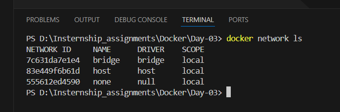
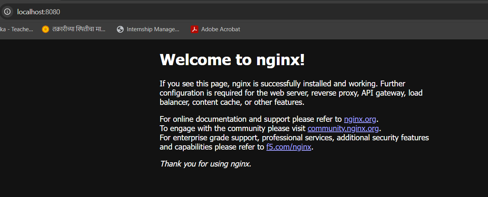
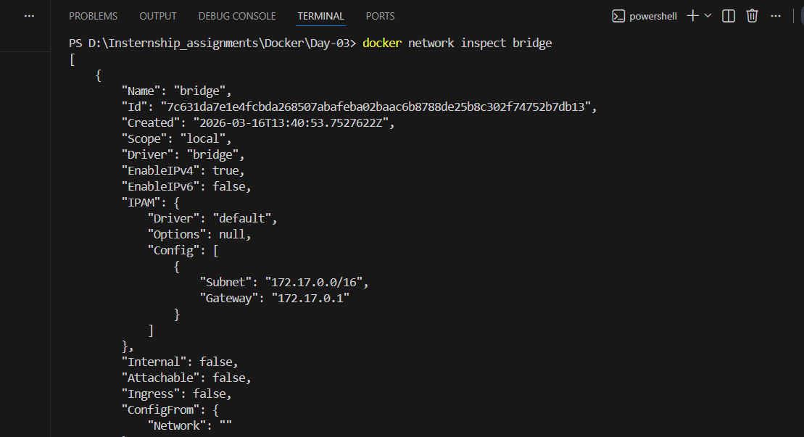
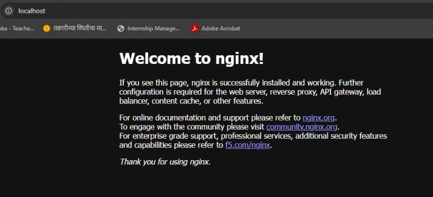
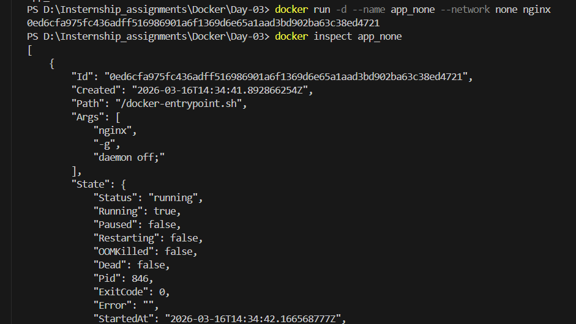
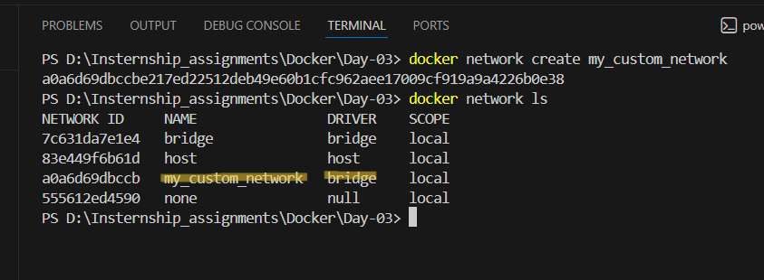
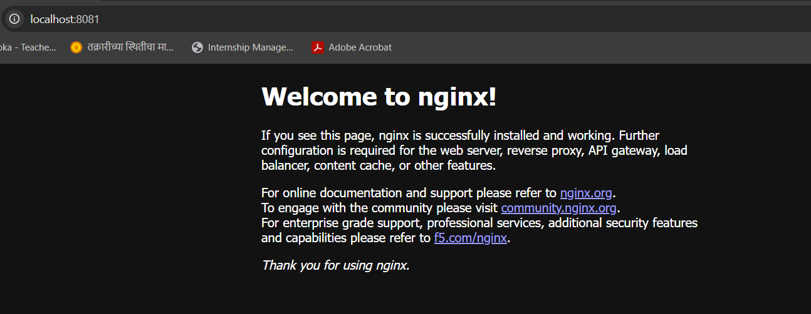

Docker Networking Task – Bridge, Host, None & Custom Network

This task demonstrates how Docker containers behave under different network configurations. It covers:

- Default Bridge Network
- Host Network
- None Network
- Custom Bridge Network

🔹 Step 1: List Available Networks
docker network ls

Docker provides three default networks:

- bridge – Default network for containers

- host – Uses host machine network

- none – No network access

🔹 Step 2: Run Container in Bridge Network
docker run -d --name app_bridge -p 8080:80 nginx

Check running containers:

docker ps

Open in browser:

http://localhost:8080

- Container runs in default bridge network
- Port 8080 maps to container port 80

🔹 Step 3: Inspect Bridge Network
docker network inspect bridge

- Shows container IP, subnet, gateway
- Displays all containers connected to bridge network

Use cases:
- Running single-container apps (like your Nginx project)
- Connecting multiple containers on same host

🔹 Step 4: Run Container in Host Network

Remove previous container:

docker rm -f app_bridge

Run container:

docker run -d --name app_host --network host nginx

Open in browser:

http://localhost

- No port mapping needed
- Container shares host’s network directly

Use cases:

- High-performance applications needing low latency 
- Network-heavy applications (real-time systems)

🔹 Step 5: Run Container in None Network

Remove previous container:

docker rm -f app_host

Run container:

docker run -d --name app_none --network none nginx

Inspect container:

docker inspect app_none

- Container has no network access
- No IP address assigned
- Cannot access internet or other containers

Use cases:

- Running secure or isolated jobs
- Security-sensitive environments

🔹 Step 6: Create Custom Bridge Network
docker network create my_custom_network

Verify:

docker network ls

- User-defined network
- Better DNS resolution between containers

Use cases

- Multi-container applications
- Microservices architecture

🔹 Step 7: Run Container in Custom Network
docker run -d --name app_custom --network my_custom_network -p 8081:80 nginx

Check:

docker ps

Inspect network:

docker network inspect my_custom_network

Open in browser:

http://localhost:8081

- Container connected to custom network
- Supports container-to-container communication using names

