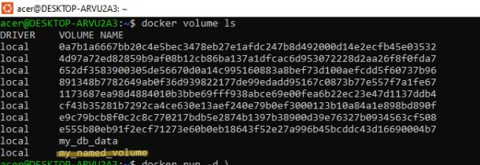
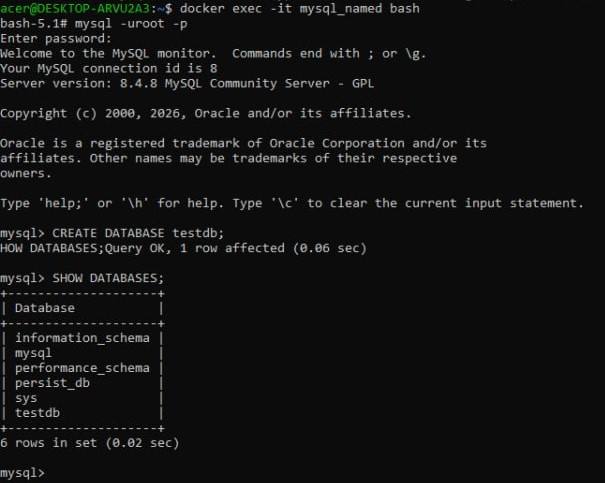
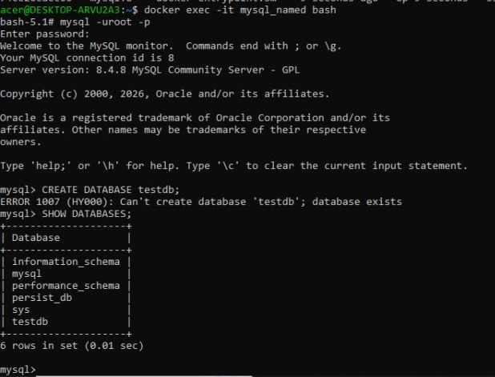
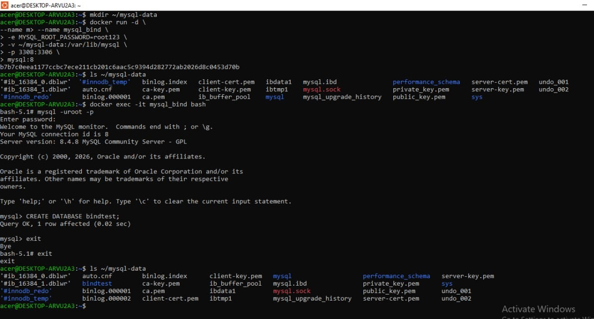
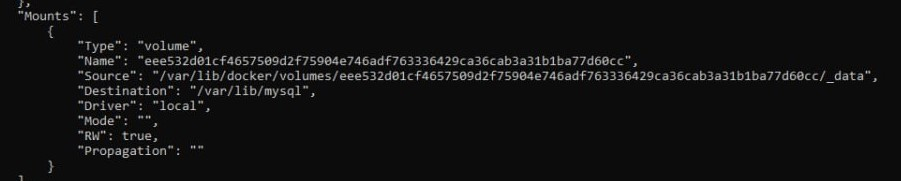
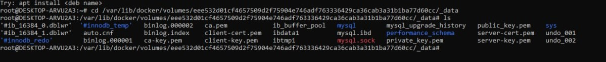

Docker Storage: Volumes & Bind Mounts

This tasks demonstrates the use of different Docker storage mechanisms:

- Named Volume
- Bind Mount
- Anonymous Volume

It also includes steps to verify how data is stored and persisted.

Type	                           Description
Named Volume	                Managed by Docker, reusable
Bind Mount	                    Maps a local system directory
Anonymous Volume	            Auto-created, unnamed volume

Task 1: Named Volume

- step1: Create Volume : docker volume create my_named_volume

- step2: verify volume : docker volume ls

- step3: Run MySQL container : docker run -d \
--name mysql_named \
-e MYSQL_ROOT_PASSWORD=root123 \
-v my_named_volume:/var/lib/mysql \
-p 3307:3306 \
mysql:8

- step 4: Access Container
docker exec -it mysql_named bash
mysql -uroot -p

- step5: Create Database
CREATE DATABASE testdb;
SHOW DATABASES;

- step 6: Test Persistence : docker rm -f mysql_named
  Re-run the container and verify: SHOW DATABASES;

  

  Task 2: Bind Mount

- Step 1: Create Local Directory : mkdir ~/mysql-data

- Step 2: Run Container : docker run -d \
--name mysql_bind \
-e MYSQL_ROOT_PASSWORD=root123 \
-v ~/mysql-data:/var/lib/mysql \
-p 3308:3306 \
mysql:8

- Step 3: Verify Data on Host: ls ~/mysql-data

- Step 4: Create Database
docker exec -it mysql_bind bash
mysql -uroot -p
CREATE DATABASE bindtest;

- Step 5: Check Local Folder Again : ls ~/mysql-data

✅ Files are visible on host → Data stored locally

Task 3: Anonymous Volume

- Step 1: Run Container : docker run -d \
--name mysql_anon \
-e MYSQL_ROOT_PASSWORD=root123 \
-v /var/lib/mysql \
-p 3309:3306 \
mysql:8

- Step 2: Inspect Container: docker inspect mysql_anon

- Step 3: List Volumes : docker volume ls

- Step 4: Inspect Volume: docker volume inspect <volume_name>

- Step 5: Access Volume Data : cd /var/lib/docker/volumes/<volume_name>/_data
                               ls

✅ Data is stored inside Docker-managed directory

