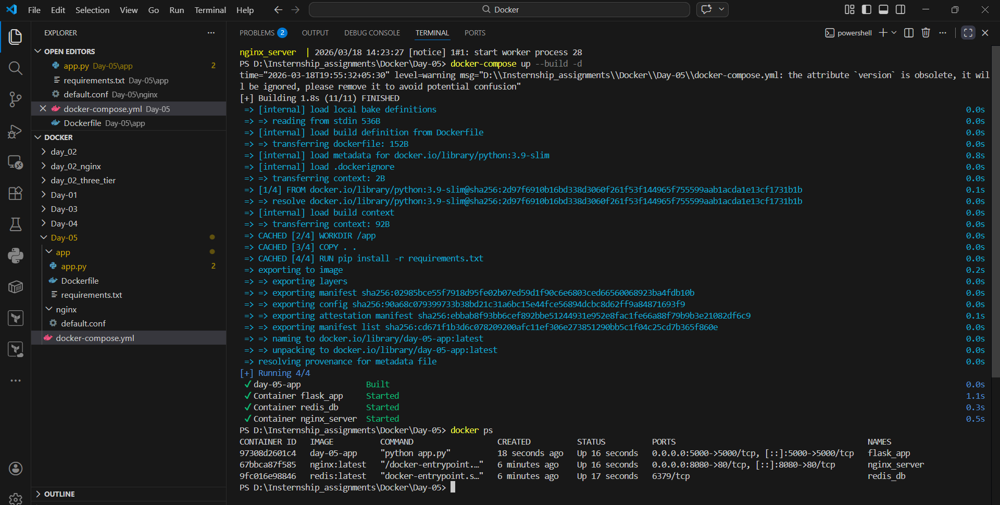
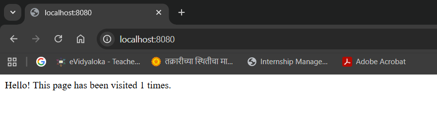

# Docker Compose Multi-Service Application
 

 This task demonstrates a multi-container application using Docker Compose. It includes:

 - Flask (Backend Application)

 - Redis (In-memory Database for counting visits)

 - Nginx (Reverse Proxy Server)

 The application counts how many times a page has been visited and displays it in the browser.

  # Architecture
  
 User → Nginx → Flask App → Redis

 - Nginx handles incoming requests

 - Flask processes logic

 - Redis stores and increments the visit counter

 Day-05/
 │
 
 ├── app/
 
 │    ├── app.py
 
 │    ├── requirements.txt
 
 │    └── Dockerfile
 
 │
 ├── nginx/
 
 │   └── default.conf
 
 │
 ├── docker-compose.yml
 
 └── README.md

 # Technologies Used

 - Docker & Docker Compose

 - Python (Flask)

 - Redis

 - Nginx

 Build and Run Containers: docker-compose up --build

 Access the Application: http://localhost:8080

 

 

 
