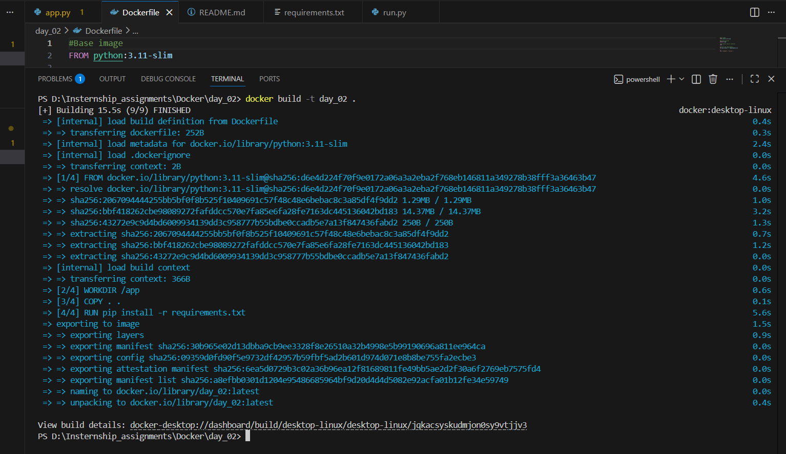
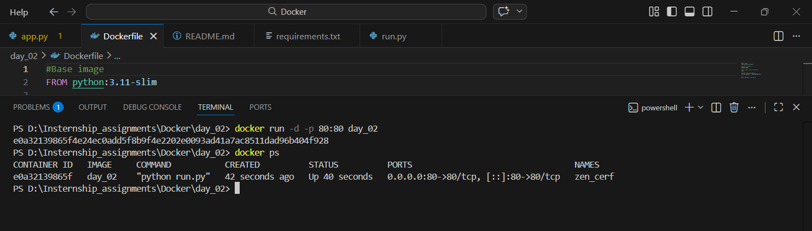

Flask Docker Application 🚀

A simple containerized Flask web application built using Python, Docker.

Project Overview

This project contains a simple Flask app. The application is packaged into a Docker container to ensure consistent deployment across environments.

Key objectives of this project:

- Build a simple Flask application
- Containerize the application using Docker
- Deploy and run the application using Docker

Tech Stack

- Python 3.11
- Flask
- Docker
- Git
- GitHub

Project Structure

flask-docker-app
│
├── app.py
├── run.py
├── requirements.txt
├── Dockerfile
└── README.md 

Setup and Installation
1. Clone the Repository

git clone https://github.com/LondheShubham153/flask-app-ecs

2. Build Docker Image

docker build -t day_02 .

3. Run Docker Container

docker run -d -p 80:80 day_02

