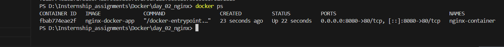
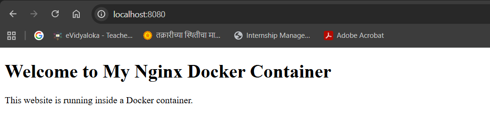

Docker Nginx Application

This task demonstrates how to deploy a simple static website using Nginx inside a Docker container. A custom Docker image is built using a Dockerfile and the container serves an HTML page through Nginx.

Project Structure
docker-nginx-project
│
├── Dockerfile
├── index.html
└── README.md

- Build Docker Image

Build the Docker image using the Dockerfile: docker build -t nginx-docker-app .

Verify the image: docker images

- Run the Docker Container

Run the container and map port 8080 on your system to port 80 inside the container :docker run -d -p 8080:80 --name nginx-container nginx-docker-app

- Access the Application

Open your browser and visit: http://localhost:8080

