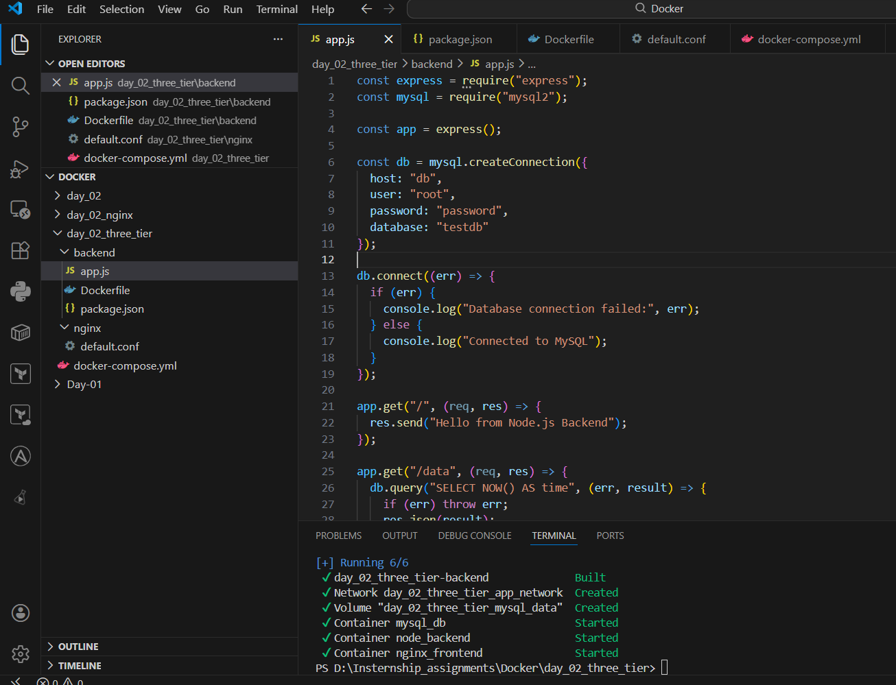
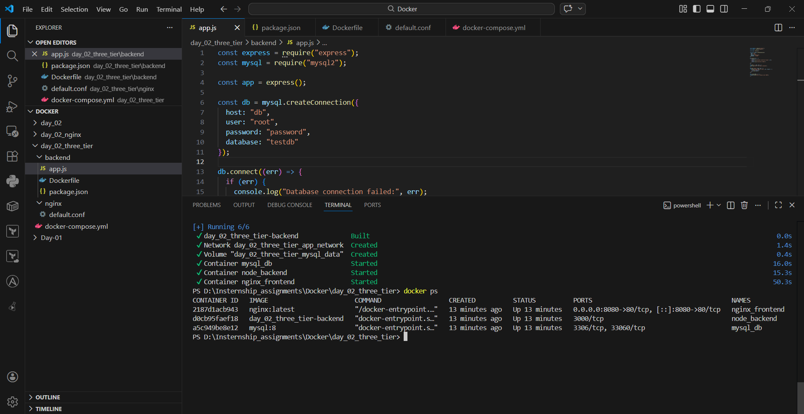
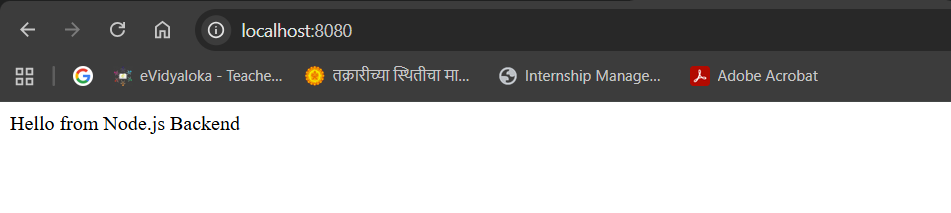
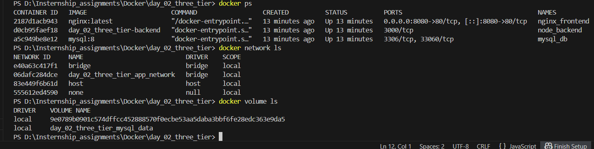

Task Overview

This task demonstrates how to build and run a 3-tier containerized application using Docker Compose.

The application consists of:

Frontend: Nginx (Reverse Proxy)

Backend: Node.js 

Database: MySQL

The services communicate using a custom bridge network, and the database uses a named volume for persistent storage.

Technologies Used

Docker

Docker Compose

Nginx

Node.js

Express.js

MySQL

Project Structure

three-tier-docker-app
│
├── docker-compose.yml
│
├── backend
│   ├── Dockerfile
│   ├── package.json
│   └── app.js
│
└── nginx
    └── default.conf

 Learning Outcomes

- Containerizing applications using Docker

- Managing multi-container applications with Docker Compose

- Creating custom Docker networks

- Using named volumes for persistent storage

 Screenshots: 

 

 

 

 

 

 

 

 

 

 

