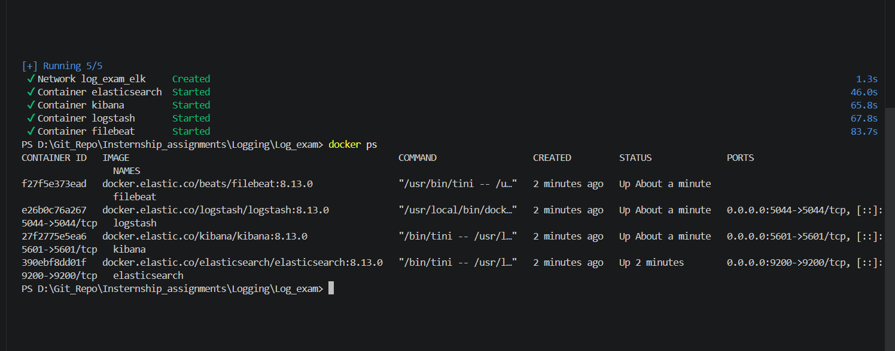
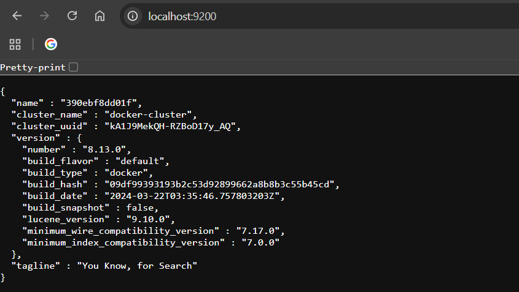
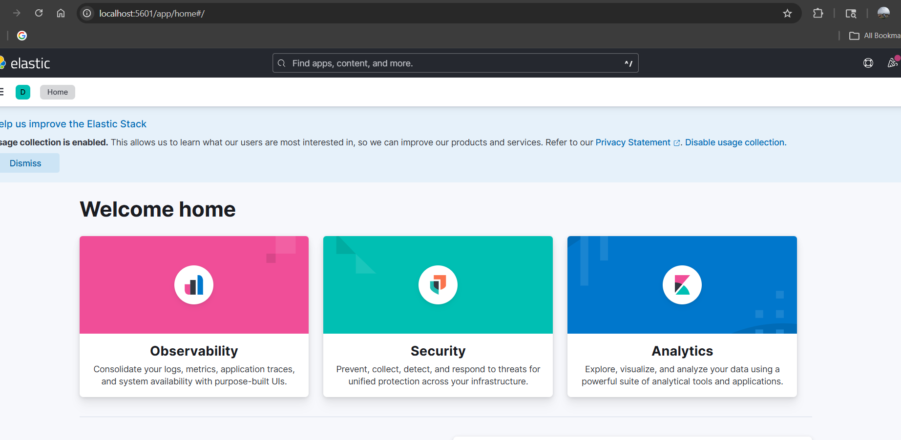
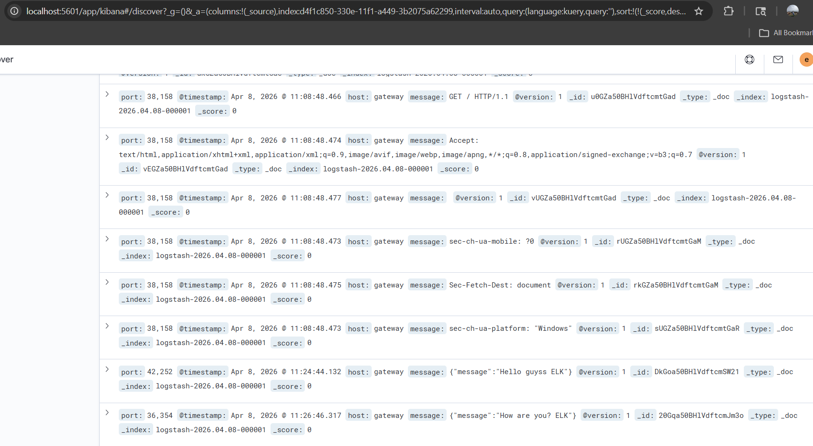
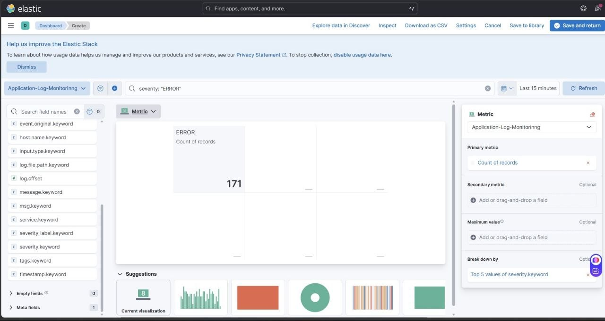
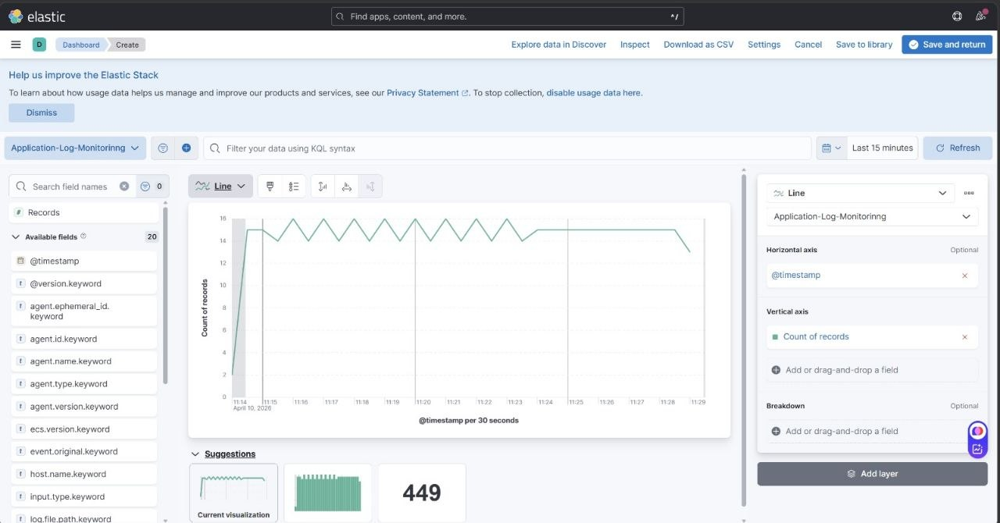
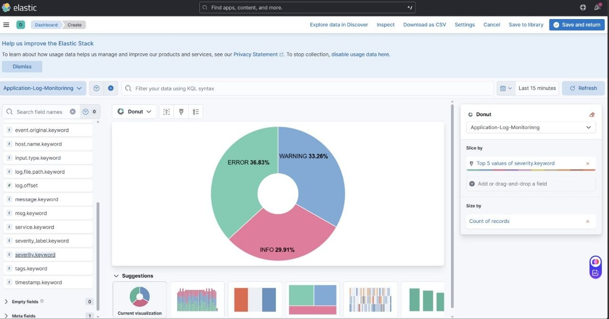

# 🚀 Task 1: ELK Stack Setup using Docker Compose

## 📌 Overview

This task demonstrates how to set up a complete **ELK Stack (Elasticsearch, Logstash, Kibana, Filebeat)** using **Docker Compose**.
The stack enables centralized logging, log processing, and visualization in a containerized environment.

---

## 🧰 Tech Stack

* Elasticsearch – Search and analytics engine
* Logstash – Log processing pipeline
* Kibana – Visualization dashboard
* Filebeat – Log shipper
* Docker & Docker Compose

---

## 📁 Project Structure

```
log_exam/
│
├── docker-compose.yml
├── logstash/
│   └── pipeline/
│       └── logstash.conf
├── filebeat/
│   └── filebeat.yml
```
---

## 🔧 Setup Instructions

### 1️⃣ Create Project

```bash
mkdir log_exam
cd log_exam
```

Create required folders:

```bash
mkdir -p logstash/pipeline
mkdir filebeat
```

---

### 2️⃣ Add Docker Compose File

Create `docker-compose.yml`

---

### 3️⃣ Configure Logstash

Create `logstash/pipeline/logstash.conf`:

---

### 4️⃣ Configure Filebeat

Create `filebeat/filebeat.yml`:

---

## ▶️ Run the Stack

Start all services using a single command:

```bash
docker compose up -d
```

---

## 🔍 Verify Setup

### Check running containers:

```bash
docker ps
```
---


---

### Test Elasticsearch:

```bash
 http://localhost:9200
```
---


---

## 📊 Access Kibana Dashboard

Open in browser:

```
http://localhost:5601
```
---



---

Logs will flow:
**Filebeat → Logstash → Elasticsearch → Kibana**

---

## ⭐ Conclusion

This project demonstrates a complete **ELK Stack setup using Docker Compose**, enabling efficient log collection, processing, and visualization in a modern DevOps environment.

---

# 🚀 Task 2 : Sample Log Generator Application (ELK Integration)

## 📌 Overview

This task demonstrates a **simple Node.js application** that continuously generates logs and integrates with the **ELK Stack (Elasticsearch, Logstash, Kibana, Filebeat)** for centralized logging and visualization.

The application produces structured logs (JSON format) at regular intervals, which are collected and processed through the ELK pipeline.

---

## 🎯 Objective

* Build a sample application that generates logs continuously
* Containerize the application using Docker
* Integrate logs with ELK Stack
* Visualize logs in Kibana

---

## 🧰 Tech Stack

* Node.js
* Express.js
* Docker
* ELK Stack (Elasticsearch, Logstash, Kibana, Filebeat)

---

## 📁 Project Structure

```
log_exam/
│
├── sample-app/
│   ├── app.js
│   ├── package.json
│   └── Dockerfile
│
├── docker-compose.yml
```

---

## 🧑‍💻 Application Details

The application:

* Runs on port **3000**
* Generates logs every **2 seconds**
* Uses structured JSON logging format

### Sample Log Format

```json
{
  "time": "2026-04-10T10:00:00.000Z",
  "level": "INFO",
  "message": "Sample log message"
}
```

---

## 🔧 Setup Instructions

### 1️⃣ Create Application Folder

```bash
mkdir sample-app
cd sample-app
```
---

### 2️⃣ Create `app.js`

```javascript
const express = require("express");
const app = express();

const PORT = 3000;

// Generate logs every 2 seconds
setInterval(() => {
  const log = {
    time: new Date().toISOString(),
    level: ["INFO", "WARN", "ERROR"][Math.floor(Math.random() * 3)],
    message: "Sample log message",
  };

  console.log(JSON.stringify(log));
}, 2000);

app.get("/", (req, res) => {
  res.send("Log generator is running...");
});

app.listen(PORT, () => {
  console.log(`App running on port ${PORT}`);
});
```

---

### 3️⃣ Create package.json

{
  "name": "sample-app",
  "version": "1.0.0",
  "description": "Sample logging app",
  "main": "app.js",
  "scripts": {
    "start": "node app.js"
  },
  "author": "Your Name",
  "license": "ISC"
}
---

### 4️⃣ Create Dockerfile

```dockerfile
FROM node:18-alpine

WORKDIR /app

COPY package*.json ./
RUN npm install

COPY . .

CMD ["node", "app.js"]
```
---

### 5️⃣ Update Docker Compose

Add the following service in `docker-compose.yml`:

```yaml
sample-app:
  build: ./sample-app
  container_name: sample-app
  ports:
    - "3000:3000"
  networks:
    - elk
```
---

## ▶️ Run the Application

From the root directory:

```bash
docker compose up -d --build
```
---

## 🔍 Verify Logs

Check application logs:

```bash
docker logs sample-app
```

You should see continuous log output in JSON format.

---

## 📊 View Logs in Kibana

Open in browser:

```
http://localhost:5601
```
---



---
### Steps:

1. Navigate to **Discover**
2. Select index pattern:

   ```
   logstash-*
   ```
3. View real-time logs 🎉

---

## 🔄 Log Flow Architecture

```
Sample App → Docker Logs → Filebeat → Logstash → Elasticsearch → Kibana
```
---

## ⭐ Conclusion

This project showcases how to build a **simple log-generating application** and integrate it with the **ELK Stack** for centralized logging, making it a valuable hands-on project for DevOps learning and real-world applications.


---

# 🚀 Task 3 : Log Ingestion with ELK Stack (Filebeat → Logstash → Elasticsearch → Kibana)

## 📌 Overview

This task demonstrates how to configure **log ingestion** using the ELK Stack.
Logs generated by a containerized application are collected using **Filebeat**, processed by **Logstash**, stored in **Elasticsearch**, and visualized in **Kibana**.

---

## 🎯 Objective

* Configure Filebeat to read application logs
* Send logs to Logstash
* Process and store logs in Elasticsearch
* Visualize logs in Kibana

---

## 🧰 Tech Stack

* Filebeat – Log shipper
* Logstash – Log processor
* Elasticsearch – Storage & search engine
* Kibana – Visualization dashboard
* Docker & Docker Compose

---

## 📁 Project Structure

```id="m4bq4g"
log_exam/
│
├── docker-compose.yml
├── filebeat/
│   └── filebeat.yml
├── logstash/
│   └── pipeline/
│       └── logstash.conf
├── sample-app/
```
---


## 🔧 Configuration Steps

---

### 1️⃣ Configure Filebeat

Edit `filebeat/filebeat.yml`:

```yaml id="o6n9m3"
filebeat.inputs:
  - type: container
    paths:
      - /var/lib/docker/containers/*/*.log

processors:
  - add_docker_metadata: ~

output.logstash:
  hosts: ["logstash:5044"]
```

### 🔍 Explanation:

* Reads logs from Docker containers
* Adds container metadata
* Sends logs to Logstash on port **5044**

---

### 2️⃣ Configure Logstash

Edit `logstash/pipeline/logstash.conf`:

```conf id="lb5smg"
input {
  beats {
    port => 5044
  }
}

filter {
  json {
    source => "message"
  }
}

output {
  elasticsearch {
    hosts => ["http://elasticsearch:9200"]
    index => "logstash-%{+YYYY.MM.dd}"
  }

  stdout { codec => rubydebug }
}
```

### 🔍 Explanation:

* Accepts logs from Filebeat
* Parses JSON logs
* Sends structured logs to Elasticsearch

---

### 3️⃣ Configure Docker Compose (Filebeat Volumes)

Ensure Filebeat service includes:

```yaml id="8qqljk"
filebeat:
  image: docker.elastic.co/beats/filebeat:8.13.0
  user: root
  volumes:
    - ./filebeat/filebeat.yml:/usr/share/filebeat/filebeat.yml
    - /var/lib/docker/containers:/var/lib/docker/containers:ro
    - /var/run/docker.sock:/var/run/docker.sock
```

### 🔍 Explanation:

* Grants Filebeat access to Docker logs
* Enables container metadata collection

---

## ▶️ Run the Stack

Restart services to apply changes:

```bash id="bd6z0n"
docker compose down
docker compose up -d --build
```
---

### View Logs

1. Go to **Discover**
2. Select `logstash-*`
3. View real-time logs 🎉

---

## 🔄 Log Flow Architecture

```id="d5u7tw"
Application → Docker Logs → Filebeat → Logstash → Elasticsearch → Kibana
```
---

## ⭐ Conclusion

This task demonstrates how to build a complete **log ingestion pipeline using ELK Stack**, enabling efficient log collection, processing, and visualization in a modern DevOps workflow.

---

# 🚀 Task 4 : Log Processing & Enrichment using Logstash (ELK Stack)

## 📌 Overview

This task demonstrates how to use **Logstash** for **log processing and enrichment** in the ELK Stack pipeline.
Logs collected from applications are parsed, transformed, and enriched with custom fields before being stored in **Elasticsearch** and visualized in **Kibana**.

---

## 🎯 Objective

* Parse incoming logs (JSON or raw format)
* Transform log fields for better structure
* Enrich logs with custom fields like:

  * `severity`
  * `service`
  * `environment`
* Store processed logs in Elasticsearch
* Visualize enriched logs in Kibana

---

## 🧰 Tech Stack

* Logstash – Log processing engine
* Filebeat – Log shipper
* Elasticsearch – Storage and search
* Kibana – Visualization
* Docker & Docker Compose

---

## 📁 Project Structure

```id="h7w2r1"
log_exam
│
├── docker-compose.yml
├── filebeat/
│   └── filebeat.yml
├── logstash/
│   └── pipeline/
│       └── logstash.conf
├── sample-app/
```

---


## 🔧 Logstash Configuration

Edit the Logstash pipeline file:

```id="z0z6m4"
logstash/pipeline/logstash.conf
```

---

### 🧩 Complete Configuration

```conf id="9xv3b0"
input {
  beats {
    port => 5044
  }
}

filter {

  # Step 1: Parse JSON logs
  json {
    source => "message"
  }

  # Step 2: Rename field (level → severity)
  mutate {
    rename => { "level" => "severity" }
  }

  # Step 3: Add custom fields
  mutate {
    add_field => {
      "service" => "sample-app"
      "environment" => "dev"
    }
  }

  # Step 4: Conditional enrichment
  if [severity] == "ERROR" {
    mutate {
      add_field => { "alert" => "true" }
    }
  }
}

output {
  elasticsearch {
    hosts => ["http://elasticsearch:9200"]
    index => "processed-logs-%{+YYYY.MM.dd}"
  }

  stdout { codec => rubydebug }
}
```
---

## ▶️ Run the Stack

Restart services to apply changes:

```bash id="j41z8c"
docker compose down
docker compose up -d --build
```
---

## 📊 View Logs in Kibana

Open browser:

```id="r3y0tq"
http://localhost:5601
```
---

## ⭐ Conclusion

This task demonstrates how to implement **log processing and enrichment using Logstash**, enabling better log structure, enhanced observability, and more powerful analysis within the ELK Stack.

---

# 🚀 Task 5 : Kibana Exploration 

## 📌 Overview

This task demonstrates how to explore and analyze logs using **Kibana**, the visualization layer of the ELK Stack.
You will create an **index pattern**, view logs in the **Discover** section, and apply filters to analyze specific log data such as **ERROR logs**.

---

## 🎯 Objective

* Create an index pattern in Kibana
* Verify logs using Discover
* Apply filters (e.g., view only ERROR logs)
* Analyze log data effectively

---

## 🧰 Tech Stack

* Kibana – Data visualization and exploration
* Elasticsearch – Data storage and search engine
* Logstash – Log processing
* Filebeat – Log collection
* Docker & Docker Compose

---

## 🌐 Access Kibana

Open your browser:

```id="q6k4mf"
http://localhost:5601
```

Wait until Kibana fully loads.

---

## 🔧 Step 1: Create Index Pattern

### 👉 Steps:

1. Click on **☰ Menu (top-left)**
2. Navigate to:

   ```
   Stack Management → Index Patterns
   ```
3. Click **Create Index Pattern**

---

### 🧾 Enter Index Pattern

Depending on your setup:

* For raw logs:

  ```
  logstash-*
  ```

Click **Next**

---

### ⏱️ Select Time Field

* Choose:

  ```
  @timestamp
  ```
* Click **Create Index Pattern**

✅ Index pattern created successfully

---

## 🔍 Step 2: Verify Logs in Discover

### 👉 Steps:

1. Go to:

   ```
   Analytics → Discover
   ```
2. Select your index pattern:

   ```
   logstash-* 
   ```
---

## ⏱️ Step 3: Adjust Time Range

* Go to the **top-right corner**
* Select time range:

  ```
  Last 15 minutes / Last 1 hour
  ```

✅ Logs will be displayed based on selected time

---

## 🎯 Step 4: Apply Filters


### 🔴 Filter Only ERROR Logs

#### Method 1: Using Filter UI

1. Click **+ Add Filter**
2. Configure:

   * Field: `severity` (or `level`)
   * Operator: `is`
   * Value: `ERROR`
3. Click **Save**

---

#### Method 2: Using Search Bar (KQL)

```id="n9y6kp"
severity: "ERROR"
```

OR

```id="8mvwr8"
level: "ERROR"
```

---

### 🟡 Additional Filters

#### INFO Logs:

```id="g1c0bh"
severity: "INFO"
```

#### Filter by Service:

```id="n9mb4m"
service: "sample-app"
```

#### Multiple Conditions:

```id="k4bbqz"
severity: "ERROR" AND service: "sample-app"
```

---

## 💾 Step 5: Save Search

1. Click **Save**
2. Enter name:

   ```
   Error Logs View
   ```
3. Click **Save**

---

.png>)

---

## ⭐ Conclusion

This task demonstrates how to effectively use **Kibana** to explore logs, apply filters, and gain insights from log data, making it an essential tool for monitoring and debugging in modern DevOps workflows.

---

# 🚀 Task 6 : Kibana Dashboard Creation 

## 📌 Overview

This task demonstrates how to create a **Kibana Dashboard** to visualize logs collected in the ELK Stack.
The dashboard provides insights into:

* Error count
* Logs over time
* Log distribution

It helps in monitoring application behavior and identifying issues in real time.

---

## 🎯 Objective

* Create visualizations using Kibana Lens
* Build a dashboard with multiple panels
* Analyze logs using charts and metrics
* Apply filters for better insights

---

## 🧰 Tech Stack

* Kibana – Data visualization
* Elasticsearch – Data storage
* Logstash – Log processing
* Filebeat – Log collection
* Docker & Docker Compose

---

## 🌐 Access Kibana

Open in browser:

```id="gqz4k1"
http://localhost:5601
```

---

## 🔧 Step 1: Create Visualization – Error Count

### 👉 Steps:

1. Go to:

   ```
   Analytics → Visualize Library
   ```
2. Click **Create Visualization**
3. Select:

   ```
   Lens
   ```
4. Choose index pattern:

   ```
   logstash-* 
   ```

---

### ⚙️ Configuration

* Metric: **Count (Records)**
* Apply filter:

  ```
  severity: "ERROR"
  ```

---

### 🎯 Output

Displays total number of ERROR logs.

---

### 💾 Save

```
Error Count
```
---



---

## 📈 Step 2: Create Visualization – Logs Over Time

### 👉 Steps:

1. Click **Create Visualization**
2. Select **Lens**
3. Choose index pattern

---

### ⚙️ Configuration

* X-axis: `@timestamp`
* Y-axis: Count (Records)

---

### 🎯 Output

Displays logs trend over time (line chart).

---

### 💾 Save

```
Logs Over Time
```
---



---

## 📊 Step 3: Create Visualization – Log Distribution

### 👉 Steps:

1. Click **Create Visualization**
2. Select **Lens**

---

### ⚙️ Configuration

* Chart type: **Pie Chart** or **Bar Chart**
* Metric: Count
* Breakdown by:

  ```
  severity OR level OR service
  ```

---

### 🎯 Output

Displays distribution of logs (INFO, ERROR, WARN).

---

### 💾 Save

```
Log Distribution
```
---


---

## 📊 Step 4: Create Dashboard

### 👉 Steps:

1. Go to:

   ```
   Analytics → Dashboard
   ```
2. Click **Create Dashboard**

---

## ➕ Step 5: Add Visualizations

1. Click **Add from Library**
2. Add:

   * Error Count
   * Logs Over Time
   * Log Distribution

---

## 🎨 Step 6: Arrange Dashboard

* Resize and organize panels
* Suggested layout:

  * Top: Error Count
  * Middle: Logs Over Time
  * Side: Log Distribution

---

## 💾 Step 7: Save Dashboard

Save with name:

```
ELK Monitoring Dashboard
```

---

## 🔍 Step 8: Apply Filters

### Filter ERROR Logs

```id="jcvq7s"
severity: "ERROR"
```
---

### Filter by Service

```id="2rkpbf"
service: "sample-app"
```

---

### Multiple Conditions

```id="m5m8mc"
severity: "ERROR" AND service: "sample-app"
```

---

## ⏱️ Step 9: Adjust Time Range

* Use top-right time selector
* Choose:

  ```
  Last 15 minutes / Last 1 hour
  ```

---

## ⭐ Conclusion

This task demonstrates how to build a **Kibana dashboard** for visualizing logs, enabling better monitoring, faster debugging, and improved observability in a DevOps environment.

---