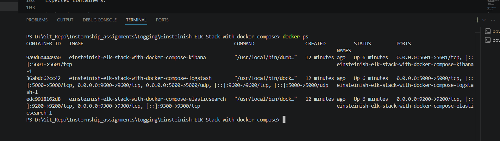
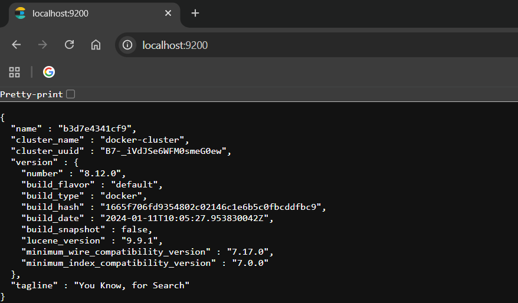

# 🚀 ELK Stack Setup Using Docker Compose

## 📌  Overview

This demonstrates how to set up the **ELK Stack (Elasticsearch, Logstash, Kibana)** using Docker Compose for centralized logging and monitoring.

The ELK stack helps in:

* Collecting logs (Logstash)
* Storing and searching logs (Elasticsearch)
* Visualizing logs (Kibana)

---

## 🛠️ Tech Stack

* Docker
* Docker Compose
* Elasticsearch
* Logstash
* Kibana

---

## 📂 Project Structure

```
.
├── docker-compose.yml
├── elasticsearch/
├── logstash/
│   └── logstash.conf
├── kibana/
└── .env (optional)
```

---

## 📥 Step 1: Clone Repository

```bash
git clone https://github.com/Einsteinish/Einsteinish-ELK-Stack-with-docker-compose.git
cd Einsteinish-ELK-Stack-with-docker-compose
```

---

## 📁 Step 2: Verify Files

Ensure these files exist:

* `docker-compose.yml`
* `logstash/logstash.conf`

---

## 🔧 Step 3: Configure Environment (Optional)

Check if `.env` file exists:

```bash
ls -a
```

If present, open it:

```bash
nano .env
```

Example:

```
ELASTIC_PASSWORD=changeme
```

---

## ▶️ Step 4: Start ELK Stack

Run the following command:

```bash
docker compose up -d
```

This will:

* Pull required Docker images
* Start Elasticsearch, Logstash, and Kibana containers

---

## 🔍 Step 5: Verify Running Containers

```bash
docker ps
```
---

---

Expected containers:

* elasticsearch
* logstash
* kibana

---

## 🌐 Step 6: Access Services

### 🔹 Elasticsearch

* URL: http://localhost:9200



---

### 🔹 Kibana (UI Dashboard)

* URL: http://localhost:5601

Use this to:

* Create dashboards
* Visualize logs
* Explore data

---

---

### 🔹 Logstash

No UI available

Check logs:

```bash
docker logs logstash
```

---

## 🔐 Authentication (If Enabled)

###  Security Enabled

* Username: `elastic`
* Password: Check `.env` or logs
---

## 🧪 Step 7: Test Log Ingestion

Send sample log:

```bash
echo "Hello ELK Stack" | nc localhost 5000
```

```bash
$tcp = New-Object System.Net.Sockets.TcpClient("localhost",5000)
$stream = $tcp.GetStream()
$writer = New-Object System.IO.StreamWriter($stream)
$writer.WriteLine('{"message":"How are you? ELK"}')
$writer.Flush()
$writer.Close()
$tcp.Close()
```
---

## 📊 Step 8: View Logs in Kibana

1. Open Kibana → http://localhost:5601
2. Go to **Discover**
3. Create Index Pattern:

   ```
   logstash-*
   ```
4. Start exploring logs

---

## 🛑 Step 9: Stop the Stack

```bash
docker compose down
```

To remove volumes:

```bash
docker compose down -v
```

---


## 🎯 Outcome

After completing this project, you will have:

* Centralized logging system
* Real-time log processing
* Visualization dashboards

---


## 📌 Conclusion

This project provides hands-on experience in setting up a production-like logging system using ELK stack, which is a key skill for DevOps Engineers.

---

# 📊 Kibana Dashboard Setup for ELK Stack


# 📈 Create Visualization

## Steps:

1. Open **Visualize Library**
2. Click **Create Visualization**
3. Select **Lens**

---

## Example Visualization: Log Count Over Time

### Configure:

* Drag `@timestamp` → X-axis
* Drag `Records` → Y-axis

This creates a time-based chart.

---

## Additional Visualizations

You can also create:

* Pie charts
* Data tables
* Bar charts
* Metric cards

---

# 💾 Save Visualization

Click **Save**

Example name:

```id="h0rzw8"
Log Count Visualization
```

---

# 📊 Create Dashboard

## Steps:

1. Open **Dashboard**
2. Click **Create Dashboard**

---

# ➕ Step 8: Add Visualizations to Dashboard

1. Click **Add from Library**
2. Select saved visualizations
3. Add them to dashboard layout

---

# 🎨 Step 9: Customize Dashboard

You can:

* Resize panels
* Rearrange charts
* Apply time filters
* Add titles

---

# 💾 Step 10: Save Dashboard

Click **Save**

Example name:

```id="r31nd9"
ELK Monitoring Dashboard
```
---


---


---


