## Assessment: Monitoring Implementation


## 📌 Title 
Design and Implement a Complete Monitoring Solution for a Containerized Application 

---

# 🧪 Task 1: Project Setup 

## 📌 Objective

Set up a well-structured project directory for deploying an application and monitoring stack using Docker Compose. This includes organizing application code, Prometheus configuration, and Grafana setup in a logical manner.

---

## 🧱 Project Directory Structure

The following directory structure is created to maintain separation of concerns:

```
monitoring-lab/
│
├── app/
│   ├── app.js
│   ├── package.json
│   └── Dockerfile
│
├── prometheus/
│   └── prometheus.yml
│
├── grafana/
│
└── docker-compose.yml
```

---

## ⚙️ Steps Performed

### 1. Create Project Folder

A root project directory named `Assessement` was created to hold all components of the monitoring system.

### 2. Create Subdirectories

* `app/` → Contains application source code and Docker configuration
* `prometheus/` → Contains Prometheus configuration file
* `grafana/` → Reserved for Grafana dashboards and configurations

### 3. Create Required Files

The following essential files were created:

* `docker-compose.yml` → Defines all services (App, Prometheus, Grafana, Node Exporter)
* `app/app.js` → Sample application code
* `app/package.json` → Node.js dependencies
* `app/Dockerfile` → Container configuration for the app
* `prometheus/prometheus.yml` → Prometheus scraping configuration

---

# 🧪 Task 2: Application Deployment 

## 📌 Objective

Deploy a sample Node.js application inside a Docker container, expose application metrics via a `/metrics` endpoint, and validate that metrics are accessible through a web browser.

---

## ⚙️ Technologies Used

* Node.js
* Express.js
* Prometheus Client (`prom-client`)
* Docker

---

## 🚀 Steps Performed


### 1. Create Application Code

Created `app.js` to

### 2. Create Dockerfile


### 3. Build Docker Image

```bash
docker build -t monitoring-app .
```

---

### 4. Run Docker Container

```bash
docker run -d -p 3000:3000 monitoring-app
```


---

### 5. Verify Application

Open browser:

```
http://localhost:3000
```

Expected Output:


---

### 6. Validate Metrics Endpoint

Open:

```
http://localhost:3000/metrics
```

Sample Output:


---

# 🧪 Task 3: Prometheus Configuration 

## 📌 Objective

Configure Prometheus to scrape both application-level and system-level metrics, and verify that all targets are in an active (UP) state.

---

## ⚙️ Technologies Used

* Prometheus
* Node Exporter
* Docker Compose

---

## 🚀 Steps Performed

### 1. Create Prometheus Configuration File

A configuration file named `prometheus.yml` was created inside the `prometheus/` directory.

---

### 2. Define Scrape Configuration

Prometheus was configured to scrape:

* Application metrics from the Node.js app
* System metrics from Node Exporter

---

### 3. Docker Compose Configuration

The `docker-compose.yml` file was updated to include Prometheus and Node Exporter services:

---

### 4. Start Services

All services were started using Docker Compose:

```bash id="qybjfx"
docker-compose up -d
```


---

### 5. Access Prometheus UI

Prometheus was accessed via browser:

```id="1y91av"
http://localhost:9090
```

---

### 6. Verify Targets

Navigated to:

```id="k2z3zk"
http://localhost:9090/targets
```

Verified that both targets were in **UP** state:

* `application` → UP
* `node_exporter` → UP


---

### 7. Test Metrics in Prometheus

Executed the following query in Prometheus UI:

```id="8t2x6s"
http_requests_total
```

This confirmed that application metrics were successfully scraped.


---


# 🧪 Task 4: Monitoring Stack Deployment 

## 📌 Objective

Deploy a complete monitoring stack using Docker Compose, including:

* Application
* Prometheus
* Grafana
* Node Exporter

Ensure all services are running and accessible via browser.

---

## ⚙️ Technologies Used

* Docker
* Docker Compose
* Prometheus
* Grafana
* Node Exporter
* Node.js Application

---

## 🧱 Services Overview

| Service       | Purpose                       |
| ------------- | ----------------------------- |
| Application   | Generates metrics             |
| Prometheus    | Collects and stores metrics   |
| Grafana       | Visualizes metrics            |
| Node Exporter | Provides system-level metrics |

---

## 🚀 Steps Performed

### 1. Create Docker Compose File

A `docker-compose.yml` file was created in the root directory to define all services.

---

### 2. Start All Services

Run the following command from the root directory:

```bash id="3o2yfi"
docker-compose up -d
```

This command:

* Builds the application image
* Starts all containers in detached mode

---

### 3. Verify Running Containers

```bash id="w9v7lf"
docker ps
```

Ensure the following containers are running:

* monitoring-app
* prometheus
* grafana
* node-exporter


---

### 4. Access Services via Browser

#### 🔹 Application

```id="b9o2m3"
http://localhost:3000
```


#### 🔹 Prometheus

```id="b72x8d"
http://localhost:9090
```


#### 🔹 Grafana

```id="c0j9ta"
http://localhost:3001
```

Login Credentials:

* Username: `admin`
* Password: `admin`


#### 🔹 Node Exporter

```id="hv8m1g"
http://localhost:9100/metrics
```

---

# 🧪 Task 5: Grafana Setup 

## 📌 Objective

Set up Grafana, connect it with Prometheus as a data source, and validate the connection to enable visualization of metrics.

---

## ⚙️ Technologies Used

* Grafana
* Prometheus
* Docker Compose

---

## 🚀 Steps Performed

### 1. Start All Services

Ensure all services are running using Docker Compose:

```bash
docker-compose up -d
```

Verify running containers:

```bash
docker ps
```

---

### 2. Access Grafana

Open Grafana in browser:

```
http://localhost:3001
```

---

### 3. Login to Grafana

Default credentials:

* Username: `admin`
* Password: `admin`

> On first login, Grafana may prompt to change the password.

---

### 4. Add Prometheus as Data Source

* Navigate to ⚙️ **Settings**
* Click **Data Sources**
* Click **Add Data Source**
* Select **Prometheus**

---

### 5. Configure Data Source

Set the Prometheus URL:

```
http://prometheus:9090
```

> Note: Use the service name `prometheus` (from Docker Compose) instead of `localhost`.

---

### 6. Validate Connection

* Click **Save & Test**

Expected result:

```
Data source is working
```


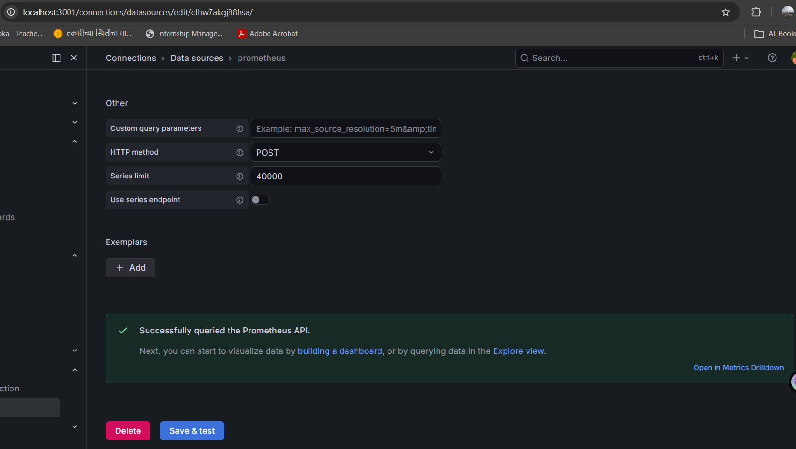
---

# 🧪 Task 6: Infrastructure Monitoring Dashboard – Grafana

## 📌 Objective

Create a Grafana dashboard to monitor system-level (infrastructure) metrics including CPU usage, memory usage, and disk availability using Prometheus data.

---

## ⚙️ Technologies Used

* Grafana
* Prometheus
* Node Exporter

---

## 🚀 Steps Performed

### 1. Open Grafana Dashboard

Access Grafana in browser:

```bash
http://localhost:3001
```

Login credentials:

* Username: `admin`
* Password: `admin`

---

### 2. Create New Dashboard

* Click ➕ **Create** from left sidebar
* Select **Dashboard**
* Click **Add visualization**

---

### 3. Add CPU Usage Panel

#### Query:

```bash
100 - (avg by(instance)(rate(node_cpu_seconds_total{mode="idle"}[1m])) * 100)
```
---

### 4. Add Memory Usage Panel

* Click **Add Panel → Add new panel**

#### Query:

```bash
(node_memory_MemTotal_bytes - node_memory_MemAvailable_bytes)
```

---

### 5. Add Disk Availability Panel

* Click **Add Panel → Add new panel**

#### Query:

```bash
(node_filesystem_size_bytes - node_filesystem_avail_bytes)
```
---

## ✅ Outcome

* Successfully created an infrastructure monitoring dashboard
* Visualized CPU, memory, and disk usage
* Used Prometheus queries for real-time monitoring
* Dashboard is ready for system performance analysis

---
## Dashboard 1: Infrastructure Monitoring
---
## CPU Usage Screenshot

used Bar graphs

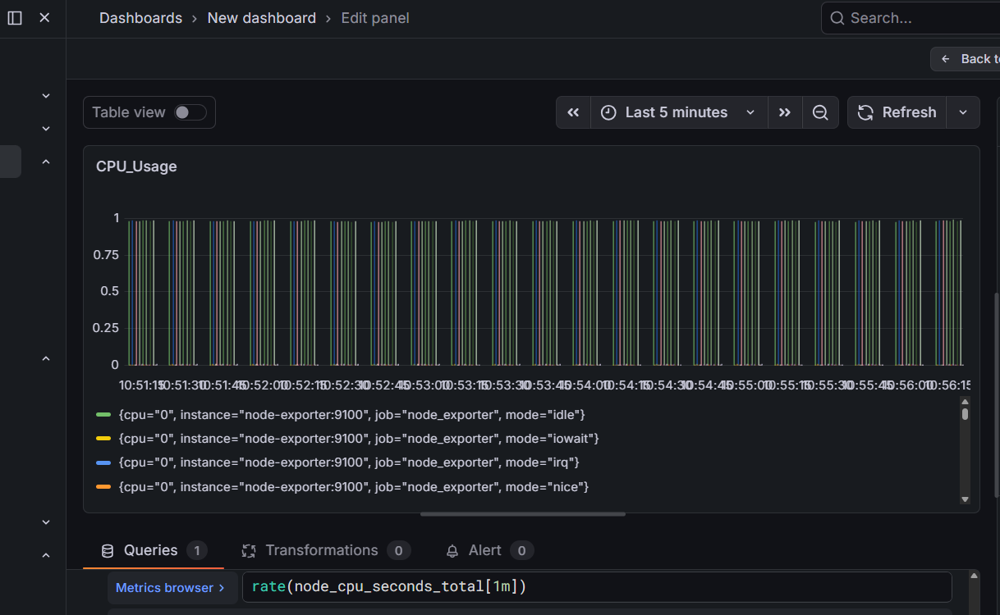

---

## Memory Usage Screenshot 

used Histogram

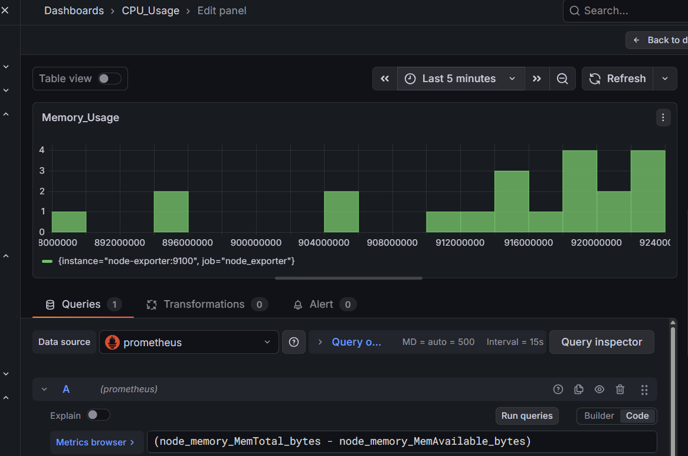

---

## Disk Usage Screenshot

use pie chart

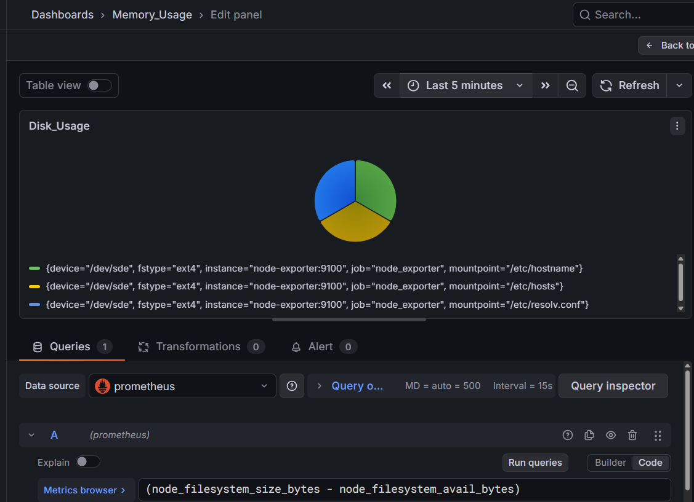

---
## Dashboard 2: Application Monitoring
---

### Add Total Requests Panel

#### Query:

```bash id="5r8l9y"
http_requests_total
```

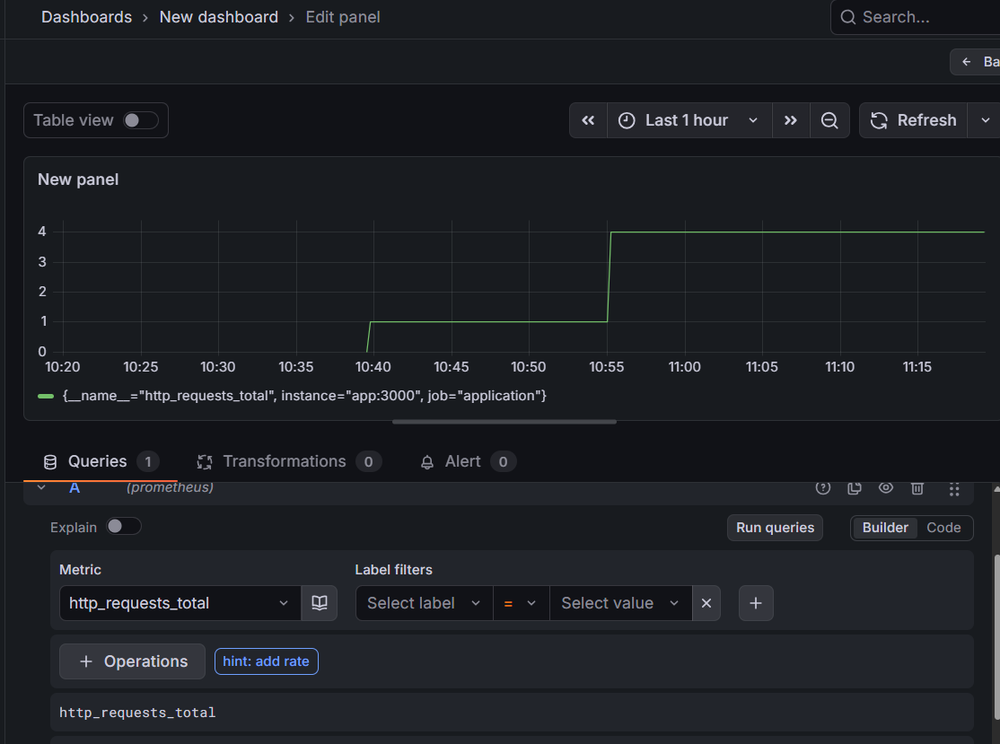

---

###  Add Requests Per Second Panel

* Click **Add Panel → Add new panel**

#### Query:

```bash id="q2t6vx"
rate(http_requests_total[1m])
```

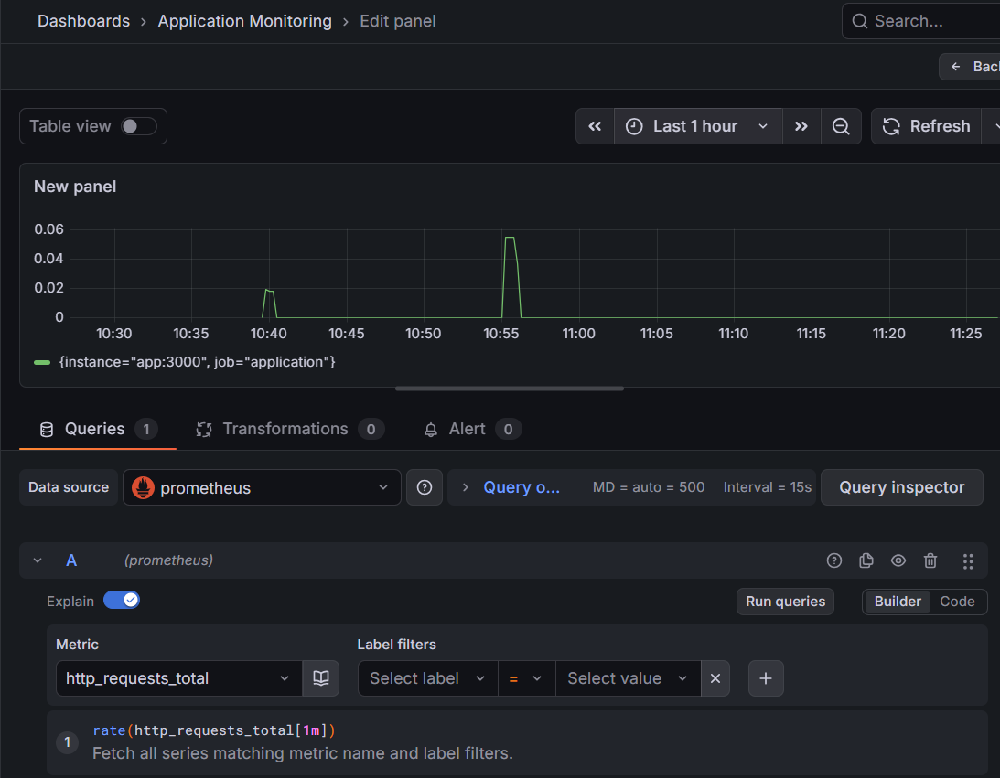
---

### Generate Traffic (for Testing)


```bash id="c6r9dy"
http://localhost:3000
```

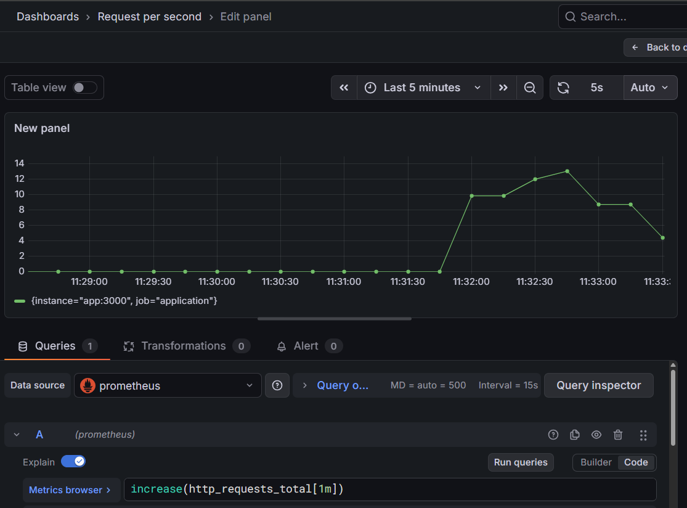
---

# 🧪 Task 7: Traffic Simulation & Analysis – Application Monitoring

### 🎯 Objective

To simulate user traffic on the application and analyze system behavior using Grafana dashboards powered by Prometheus metrics.

---

### 🛠️ Tools Used

* Docker & Docker Compose
* Prometheus
* Grafana
* Node Exporter
* ApacheBench (ab) / curl

---

### ⚙️ Steps Performed


####  Access Monitoring Dashboards

Opened Grafana dashboards in browser:

```
http://localhost:3001
```

Two dashboards monitored:

* **Infrastructure Monitoring**
* **Application Monitoring**

---

#### Generate Traffic

Traffic was simulated using multiple methods:

```
http://localhost:3000
```
---

#### 4️⃣ Observations from Dashboards

##### 📊 Application Metrics

* **Total Requests:** Increased continuously as traffic was generated
* **Requests Per Second:** Showed spikes during load
* **Traffic Trend:** Displayed bursts of incoming requests over time

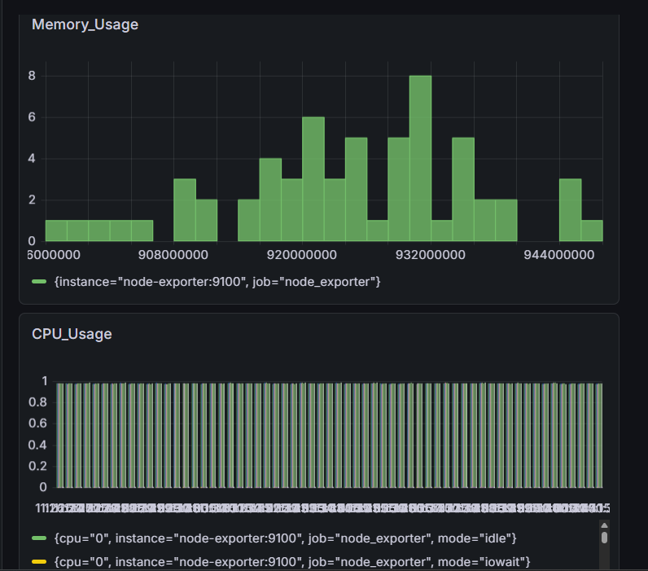
---
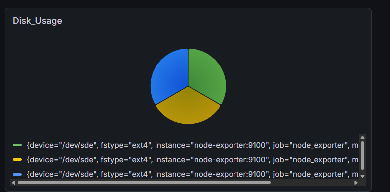

##### 🖥️ Infrastructure Metrics

* **CPU Usage:** Increased during high traffic indicating processing load
* **Memory Usage:** Slight increase observed depending on request volume
* **Disk Usage:** Remained mostly stable

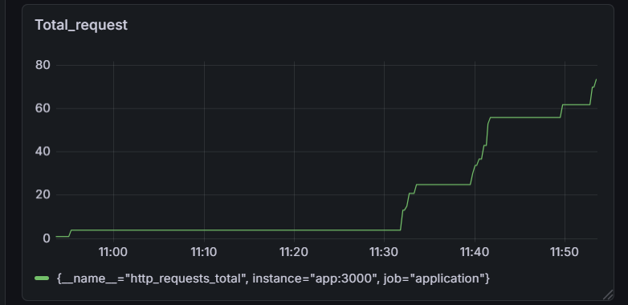

---

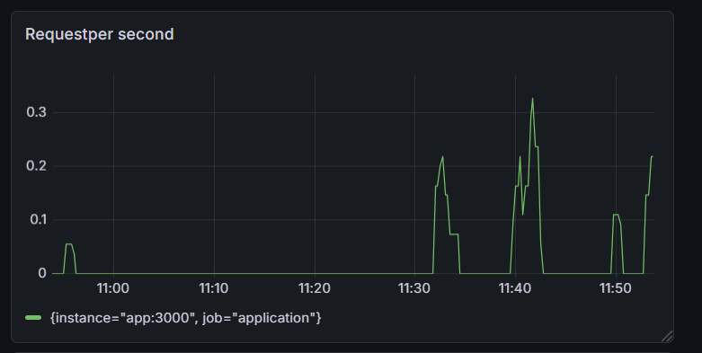

---

### 🔍 Behavior Analysis

* Increased traffic directly resulted in higher request rates
* CPU usage spiked during load, indicating system stress
* The metric `http_requests_total` behaved as a counter and only increased
* Rate-based queries (`rate()`) effectively showed real-time request trends

---

## 🔍 Task 8: Observability Analysis

### 1️⃣ Difference between Infrastructure and Application Metrics

Infrastructure metrics represent the health and performance of system resources such as CPU usage, memory consumption, and disk space. These metrics help in understanding how well the underlying system is performing.
Application metrics, on the other hand, focus on the behavior of the application itself, such as request count, response time, and error rates. They provide insights into how users interact with the application and how the application performs under load.

---

### 2️⃣ Why Counters Require `rate()` / `increase()` Functions

Counters are cumulative metrics that only increase over time and never decrease (e.g., total number of requests). Because of this, their raw values do not provide meaningful real-time insights.
Functions like `rate()` and `increase()` are used to calculate the change in counter values over a specific time window. This helps in understanding trends such as requests per second or traffic spikes, making the data more useful for monitoring and analysis.

---

### 3️⃣ How Monitoring Helps in Troubleshooting

Monitoring provides real-time visibility into both system and application performance, allowing issues to be detected early. By analyzing metrics and dashboards, it becomes easier to identify errors such as high CPU usage or increased error rates.
This helps in quickly diagnosing the root cause of problems and reduces system downtime, ensuring better reliability and performance.

---

## Bonus Task

## 📈 Custom Metric Implementation & Visualization

### 🎯 Objective

To enhance application observability by adding a custom metric (error count) and visualizing it in Grafana for better monitoring and analysis.

---

### 🛠️ Implementation Details

#### Added Custom Metric (Error Counter)

---

#### 2️⃣ Rebuilt and Deployed Application

After updating the code, the application was rebuilt and restarted using Docker Compose:

```bash
docker-compose down
docker-compose up -d --build
```

---

#### 3️⃣ Traffic Simulation for Errors

Error traffic was generated to test the custom metric:

```bash
http://localhost:3000/error
```

This increased the value of the `http_errors_total` metric.

---

#### 4️⃣ Metric Verification in Prometheus

The custom metric was verified by querying in Prometheus:

```
http_errors_total
```

The metric value increased as error requests were triggered.

---

### 📊 Grafana Visualization

#### 1️⃣ Panel Creation

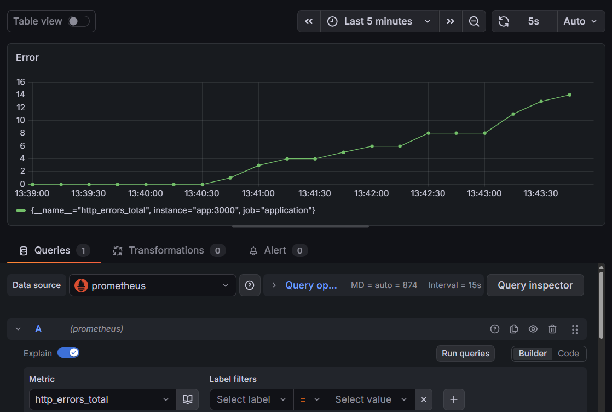

---


