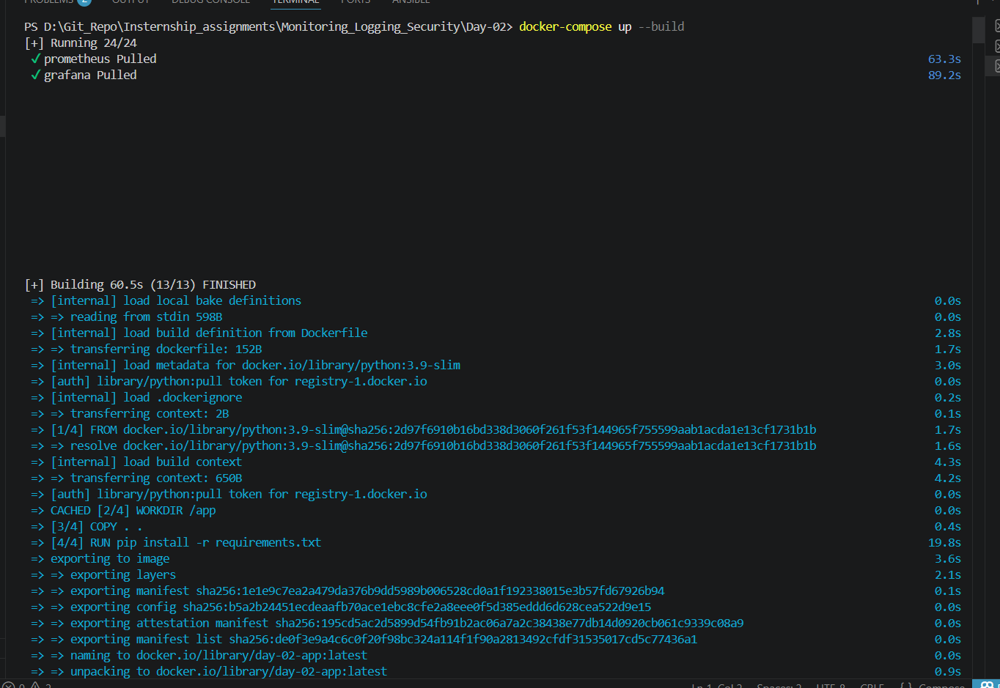
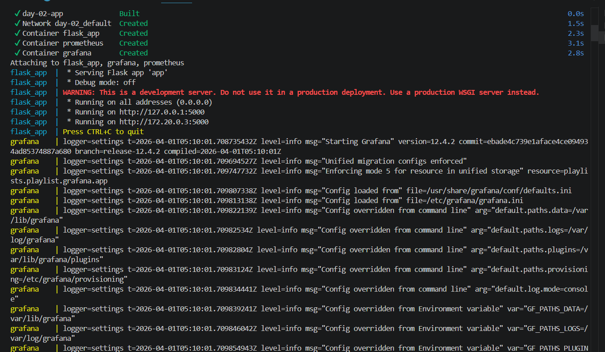
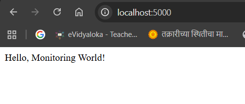
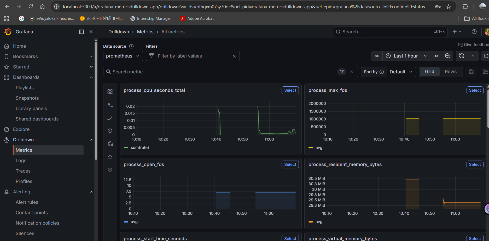
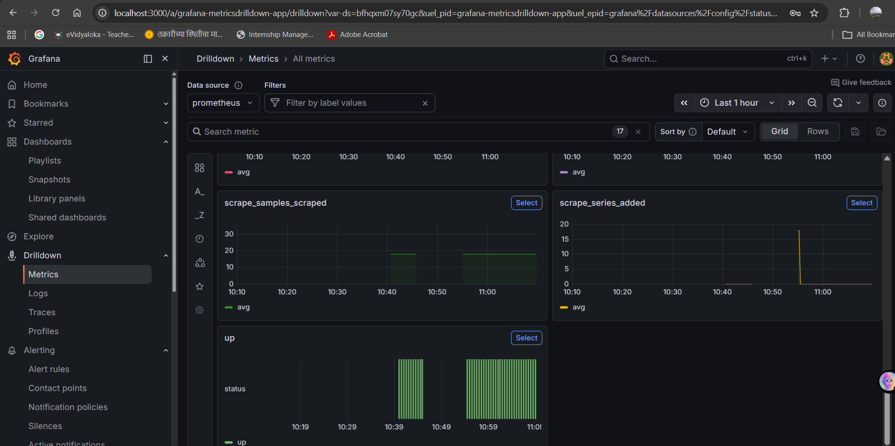
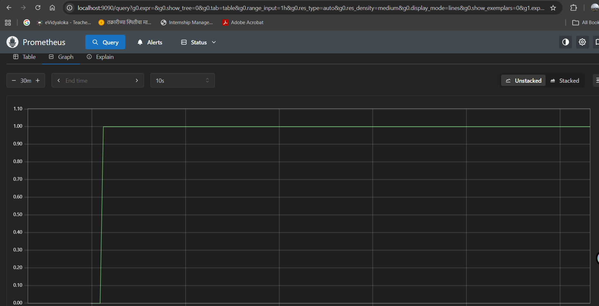

# 📊 Docker Monitoring using Prometheus & Grafana

## 🚀 Task Overview

This task demonstrates how to containerize a simple Python Flask application using Docker and monitor it using Prometheus and Grafana.

The application exposes custom metrics, which are scraped by Prometheus and visualized through Grafana dashboards.

---

## 🛠️ Tech Stack

* Python Flask (Application)
* Docker & Docker Compose (Containerization)
* Prometheus (Metrics Collection)
* Grafana (Visualization)

---

## 📁 Project Structure

```
monitoring-project/
│
├── app/
│   ├── app.py
│   ├── requirements.txt
│   └── Dockerfile
│
├── prometheus/
│   └── prometheus.yml
│
├── docker-compose.yml
```

---


## 🐳 Setup & Installation


## 🌐 Access the Services

| Service    | URL                   |
| ---------- | --------------------- |
| Flask App  | http://localhost:5000 |
| Prometheus | http://localhost:9090 |
| Grafana    | http://localhost:3000 |

---

## 📊 Prometheus Configuration

Prometheus is configured to scrape metrics from the Flask app:

```
targets: ['app:8000']
```

Metrics are exposed using the `prometheus_client` library.

---

## 📈 Grafana Setup

### Login Credentials:

* Username: `admin`
* Password: `admin`

---

### Add Prometheus Data Source:

1. Go to **Settings → Data Sources**
2. Click **Add Data Source**
3. Select **Prometheus**
4. Enter URL:

```
http://prometheus:9090
```

5. Click **Save & Test**

---

## 📉 Create Dashboard

1. Go to **+ → Dashboard**
2. Click **Add Panel**
3. Use query:

```
request_count_total
```

4. Apply changes

---


## ✅ Verification

* Application is running successfully
* Prometheus is scraping metrics
* Grafana is displaying metrics
* Request count increases with traffic

---
## Screenshots




















