# 🧪 Task 1: Project Setup 

## 📌 Objective

Set up a well-structured project directory for deploying an application and monitoring stack using Docker Compose. This includes organizing application code, Prometheus configuration, and Grafana setup in a logical manner.

---

## 🧱 Project Directory Structure

The following directory structure is created to maintain separation of concerns:

```
monitoring-lab/
│
├── app/
│   ├── app.js
│   ├── package.json
│   └── Dockerfile
│
├── prometheus/
│   └── prometheus.yml
│
├── grafana/
│
└── docker-compose.yml
```

---

## ⚙️ Steps Performed

### 1. Create Project Folder

A root project directory named `Day-03` was created to hold all components of the monitoring system.

### 2. Create Subdirectories

* `app/` → Contains application source code and Docker configuration
* `prometheus/` → Contains Prometheus configuration file
* `grafana/` → Reserved for Grafana dashboards and configurations

### 3. Create Required Files

The following essential files were created:

* `docker-compose.yml` → Defines all services (App, Prometheus, Grafana, Node Exporter)
* `app/app.js` → Sample application code
* `app/package.json` → Node.js dependencies
* `app/Dockerfile` → Container configuration for the app
* `prometheus/prometheus.yml` → Prometheus scraping configuration

---

# 🧪 Task 2: Application Deployment 

## 📌 Objective

Deploy a sample Node.js application inside a Docker container, expose application metrics via a `/metrics` endpoint, and validate that metrics are accessible through a web browser.

---

## ⚙️ Technologies Used

* Node.js
* Express.js
* Prometheus Client (`prom-client`)
* Docker

---

## 🚀 Steps Performed


### 2. Create Application Code

Created `app.js` to

### 3. Create Dockerfile


### 4. Build Docker Image

```bash
docker build -t monitoring-app .
```

---

### 5. Run Docker Container

```bash
docker run -d -p 3000:3000 monitoring-app
```

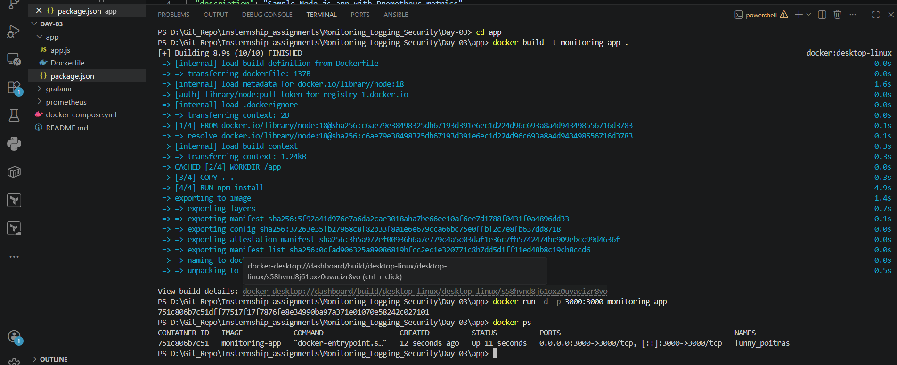

---

### 6. Verify Application

Open browser:

```
http://localhost:3000
```

Expected Output:

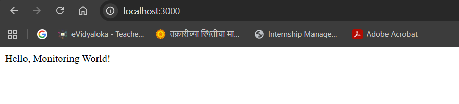
---

### 7. Validate Metrics Endpoint

Open:

```
http://localhost:3000/metrics
```

Sample Output:

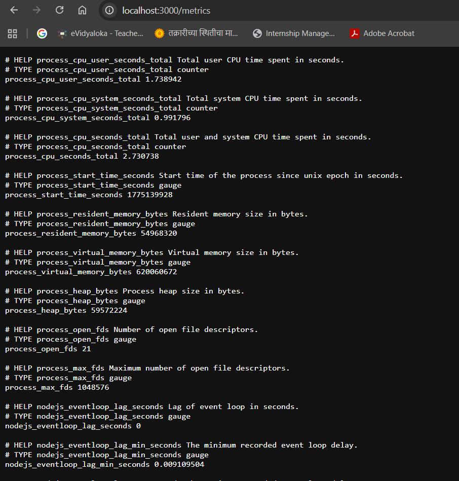
---

# 🧪 Task 3: Prometheus Configuration 

## 📌 Objective

Configure Prometheus to scrape both application-level and system-level metrics, and verify that all targets are in an active (UP) state.

---

## ⚙️ Technologies Used

* Prometheus
* Node Exporter
* Docker Compose

---

## 🚀 Steps Performed

### 1. Create Prometheus Configuration File

A configuration file named `prometheus.yml` was created inside the `prometheus/` directory.

---

### 2. Define Scrape Configuration

Prometheus was configured to scrape:

* Application metrics from the Node.js app
* System metrics from Node Exporter

---

### 3. Docker Compose Configuration

The `docker-compose.yml` file was updated to include Prometheus and Node Exporter services:

---

### 4. Start Services

All services were started using Docker Compose:

```bash id="qybjfx"
docker-compose up -d
```
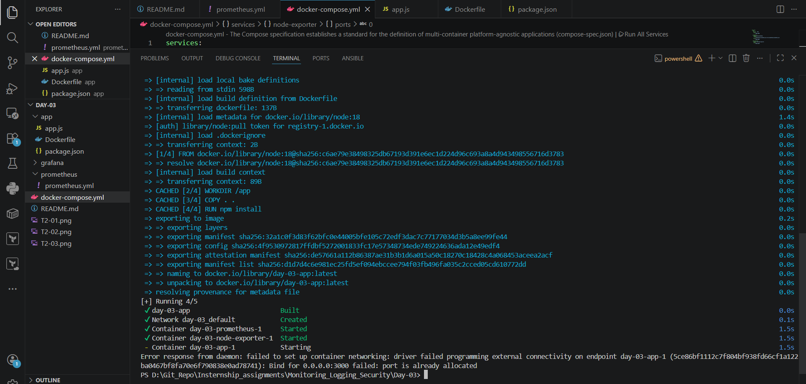

---

### 5. Access Prometheus UI

Prometheus was accessed via browser:

```id="1y91av"
http://localhost:9090
```
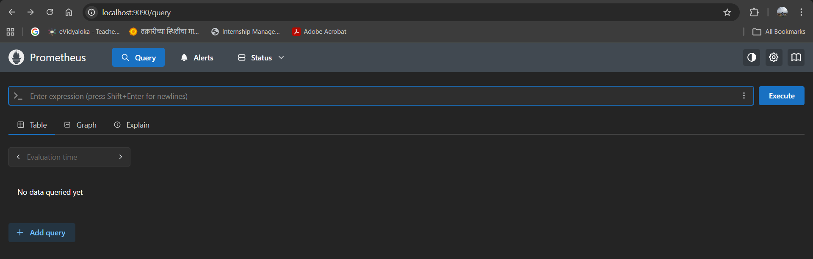
---

### 6. Verify Targets

Navigated to:

```id="k2z3zk"
http://localhost:9090/targets
```

Verified that both targets were in **UP** state:

* `application` → UP
* `node_exporter` → UP

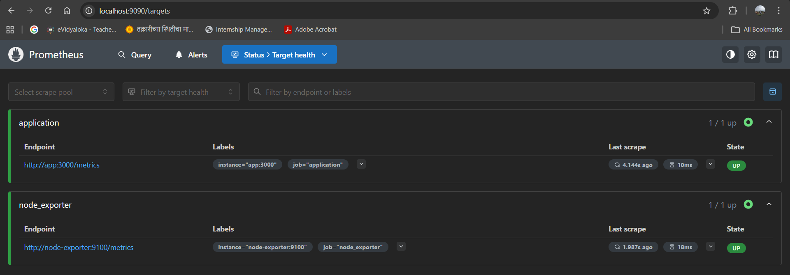

---

### 7. Test Metrics in Prometheus

Executed the following query in Prometheus UI:

```id="8t2x6s"
http_requests_total
```

This confirmed that application metrics were successfully scraped.

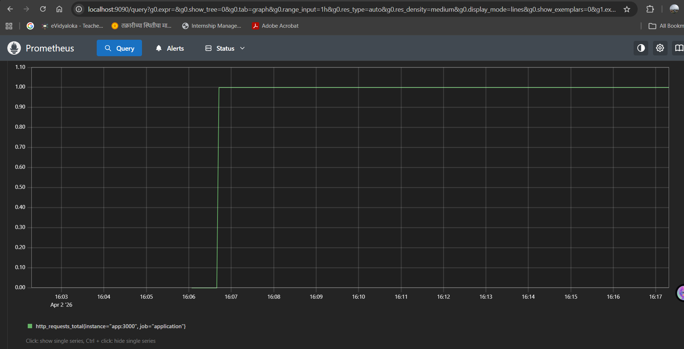
---

## 🧠 Key Concepts

* **Scraping**: Prometheus periodically collects metrics from defined targets.
* **Targets**: Endpoints (like app and node exporter) from which metrics are fetched.
* **Node Exporter**: Provides system-level metrics such as CPU, memory, and disk usage.
* **Scrape Interval**: Defines how frequently metrics are collected.

---

# 🧪 Task 4: Monitoring Stack Deployment 

## 📌 Objective

Deploy a complete monitoring stack using Docker Compose, including:

* Application
* Prometheus
* Grafana
* Node Exporter

Ensure all services are running and accessible via browser.

---

## ⚙️ Technologies Used

* Docker
* Docker Compose
* Prometheus
* Grafana
* Node Exporter
* Node.js Application

---

## 🧱 Services Overview

| Service       | Purpose                       |
| ------------- | ----------------------------- |
| Application   | Generates metrics             |
| Prometheus    | Collects and stores metrics   |
| Grafana       | Visualizes metrics            |
| Node Exporter | Provides system-level metrics |

---

## 🚀 Steps Performed

### 1. Create Docker Compose File

A `docker-compose.yml` file was created in the root directory to define all services.

---

### 2. Start All Services

Run the following command from the root directory:

```bash id="3o2yfi"
docker-compose up -d
```

This command:

* Builds the application image
* Starts all containers in detached mode

---

### 3. Verify Running Containers

```bash id="w9v7lf"
docker ps
```

Ensure the following containers are running:

* monitoring-app
* prometheus
* grafana
* node-exporter

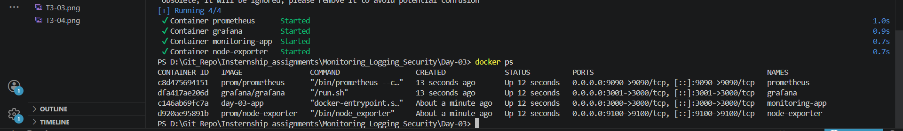
---

### 4. Access Services via Browser

#### 🔹 Application

```id="b9o2m3"
http://localhost:3000
```
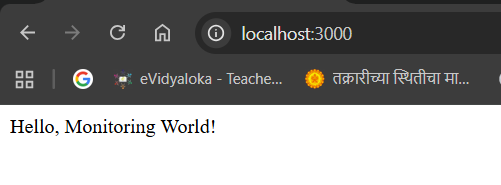


#### 🔹 Prometheus

```id="b72x8d"
http://localhost:9090
```

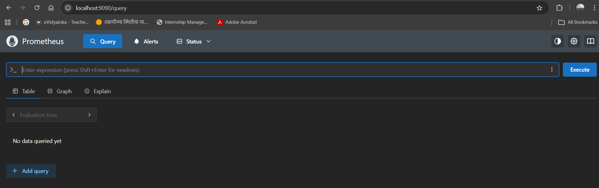

#### 🔹 Grafana

```id="c0j9ta"
http://localhost:3001
```

Login Credentials:

* Username: `admin`
* Password: `admin`

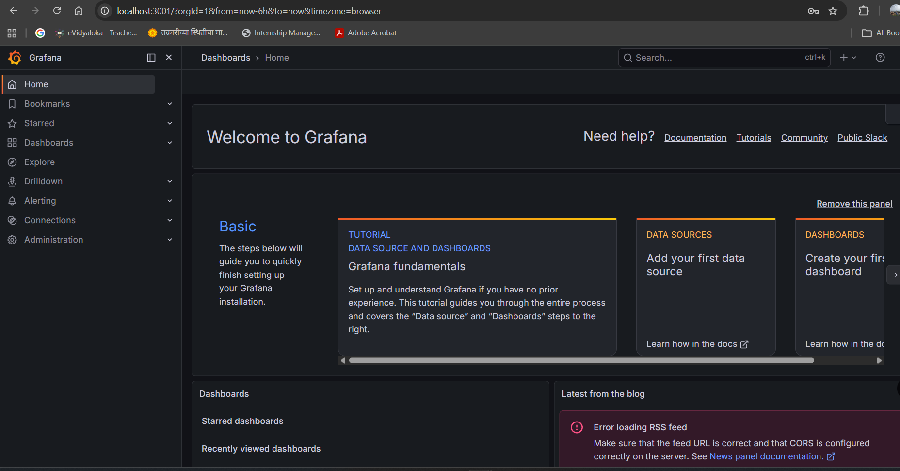
#### 🔹 Node Exporter

```id="hv8m1g"
http://localhost:9100/metrics
```
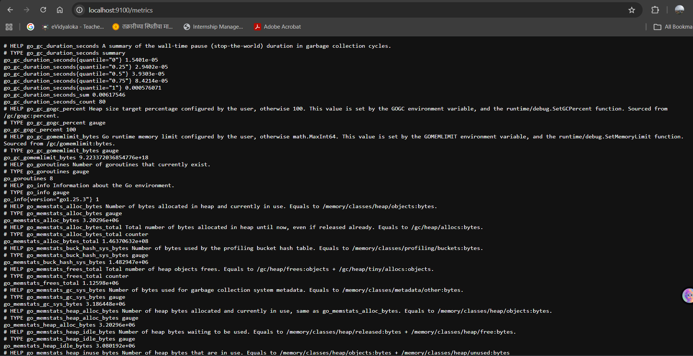
---

# 🧪 Task 5: Grafana Setup 

## 📌 Objective

Set up Grafana, connect it with Prometheus as a data source, and validate the connection to enable visualization of metrics.

---

## ⚙️ Technologies Used

* Grafana
* Prometheus
* Docker Compose

---

## 🚀 Steps Performed

### 1. Start All Services

Ensure all services are running using Docker Compose:

```bash
docker-compose up -d
```

Verify running containers:

```bash
docker ps
```

---

### 2. Access Grafana

Open Grafana in browser:

```
http://localhost:3001
```

---

### 3. Login to Grafana

Default credentials:

* Username: `admin`
* Password: `admin`

> On first login, Grafana may prompt to change the password.

---

### 4. Add Prometheus as Data Source

* Navigate to ⚙️ **Settings**
* Click **Data Sources**
* Click **Add Data Source**
* Select **Prometheus**

---

### 5. Configure Data Source

Set the Prometheus URL:

```
http://prometheus:9090
```

> Note: Use the service name `prometheus` (from Docker Compose) instead of `localhost`.

---

### 6. Validate Connection

* Click **Save & Test**

Expected result:

```
Data source is working
```
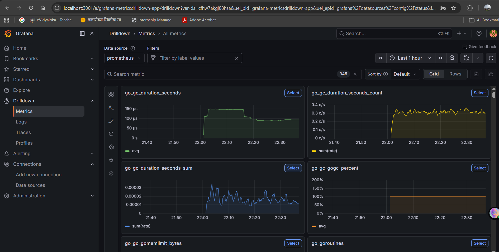

---

# 🧪 Task 6: Infrastructure Monitoring Dashboard – Grafana

## 📌 Objective

Create a Grafana dashboard to monitor system-level (infrastructure) metrics including CPU usage, memory usage, and disk availability using Prometheus data.

---

## ⚙️ Technologies Used

* Grafana
* Prometheus
* Node Exporter

---

## 🚀 Steps Performed

### 1. Open Grafana Dashboard

Access Grafana in browser:

```bash
http://localhost:3001
```

Login credentials:

* Username: `admin`
* Password: `admin`

---

### 2. Create New Dashboard

* Click ➕ **Create** from left sidebar
* Select **Dashboard**
* Click **Add visualization**

---

### 3. Add CPU Usage Panel

#### Query:

```bash
100 - (avg by(instance)(rate(node_cpu_seconds_total{mode="idle"}[1m])) * 100)
```
---

### 4. Add Memory Usage Panel

* Click **Add Panel → Add new panel**

#### Query:

```bash
(node_memory_MemTotal_bytes - node_memory_MemAvailable_bytes)
```

---

### 5. Add Disk Availability Panel

* Click **Add Panel → Add new panel**

#### Query:

```bash
(node_filesystem_size_bytes - node_filesystem_avail_bytes)
```
---

## ✅ Outcome

* Successfully created an infrastructure monitoring dashboard
* Visualized CPU, memory, and disk usage
* Used Prometheus queries for real-time monitoring
* Dashboard is ready for system performance analysis

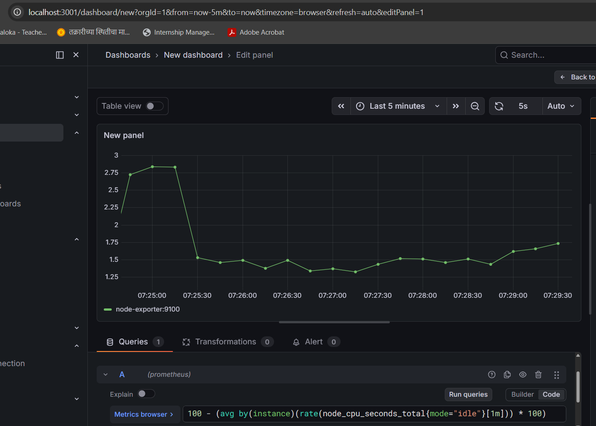


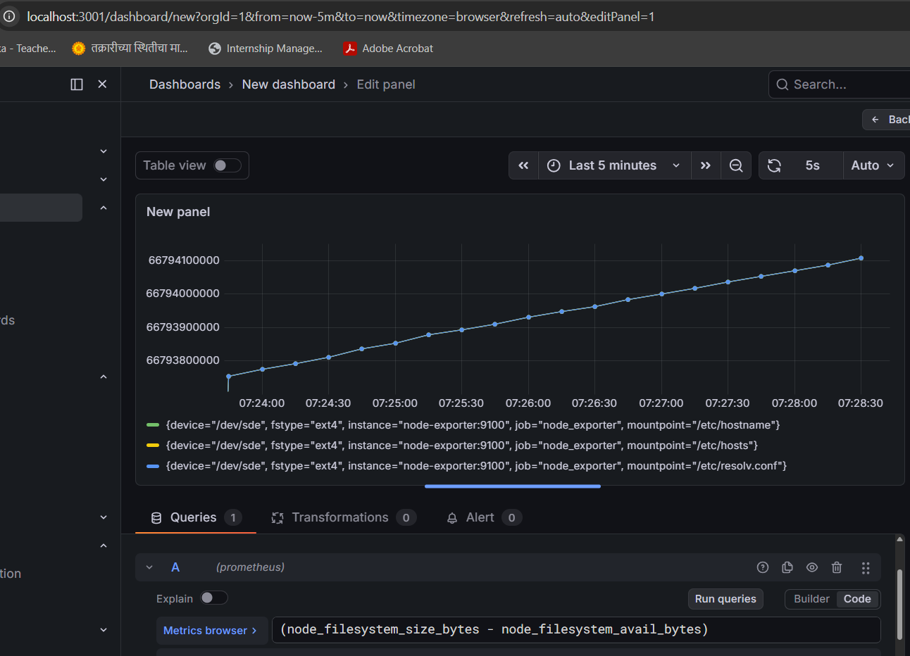


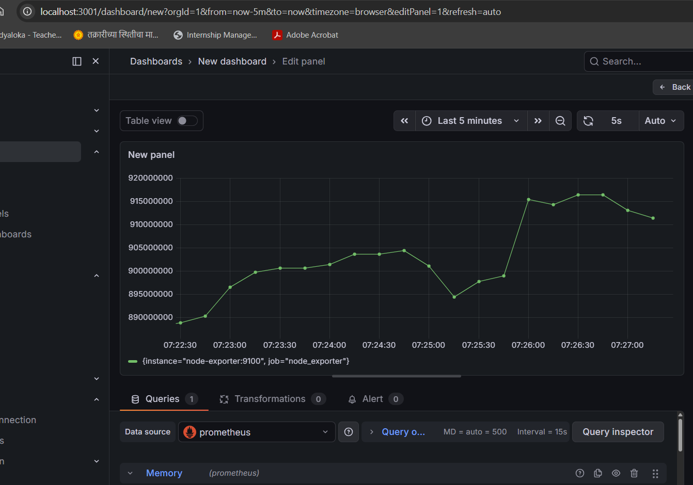

---

# 🧪 Task 7: Application Monitoring Dashboard – Grafana

## 📌 Objective

Create a Grafana dashboard to monitor application-level metrics such as total requests, requests per second, and request trends using Prometheus data.

---

## ⚙️ Technologies Used

* Grafana
* Prometheus
* Node.js Application (with Prometheus metrics)

---

## 🚀 Steps Performed

### 1. Open Grafana

Access Grafana in browser:

```bash id="x9h3kq"
http://localhost:3001
```

Login credentials:

* Username: `admin`
* Password: `admin`

---

### 2. Create New Dashboard

* Click ➕ **Create** from left sidebar
* Select **Dashboard**
* Click **Add visualization**

---

### 3. Add Total Requests Panel

#### Query:

```bash id="5r8l9y"
http_requests_total
```
---

### 4. Add Requests Per Second Panel

* Click **Add Panel → Add new panel**

#### Query:

```bash id="q2t6vx"
rate(http_requests_total[1m])
```
---

### 5. Add Requests Trend Panel

* Click **Add Panel → Add new panel**

#### Query:

```bash id="3n7wkp"
increase(http_requests_total[5m])
```
---


### 8. Generate Traffic (for Testing)


```bash id="c6r9dy"
http://localhost:3000
```
---

### 9. Verify Dashboard

* Total requests should increase
* Requests per second graph should show spikes
* Trend graph should update over time

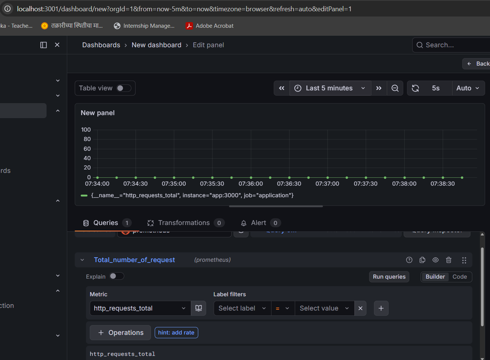

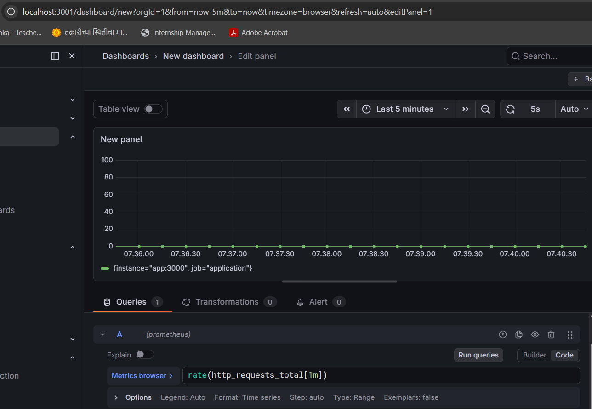

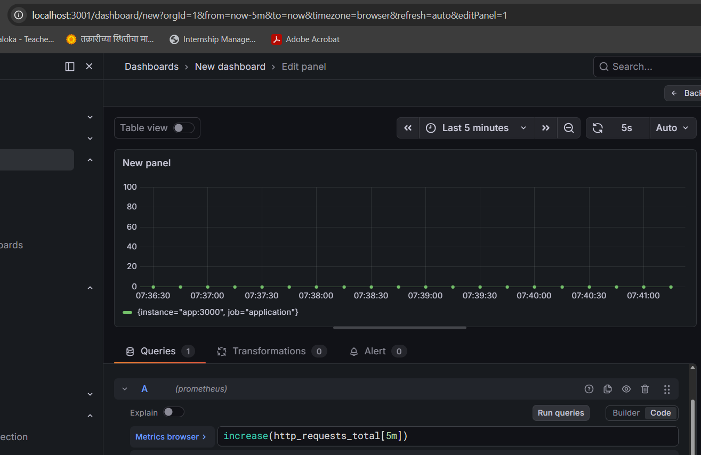


```bash id="c6r9dy"
screenshot after generating traffic
```

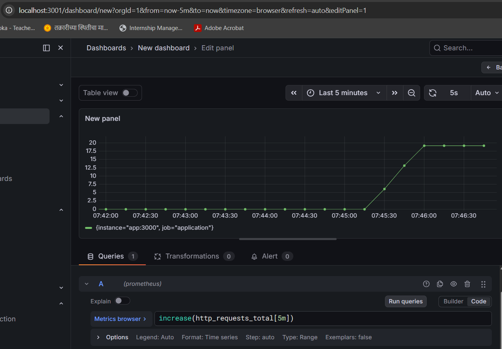
---

# 🧪 Task 8: Traffic Simulation & Analysis – Application Monitoring

## 📌 Objective

Simulate traffic on the application to generate load, observe real-time changes in Grafana dashboards, and identify patterns in application and infrastructure metrics.

---

## ⚙️ Technologies Used

* Node.js Application
* Prometheus
* Grafana
* Docker Compose
* Curl / ApacheBench (for traffic generation)

---

## 🚀 Steps Performed


### 1. Open Grafana Dashboards

Access Grafana:

```bash id="q8v1nx"
http://localhost:3001
```

Navigate to:

* Infrastructure Monitoring Dashboard
* Application Monitoring Dashboard

---

### 2. Generate Traffic (Basic Load)

---

### 6. Observe Grafana Dashboards

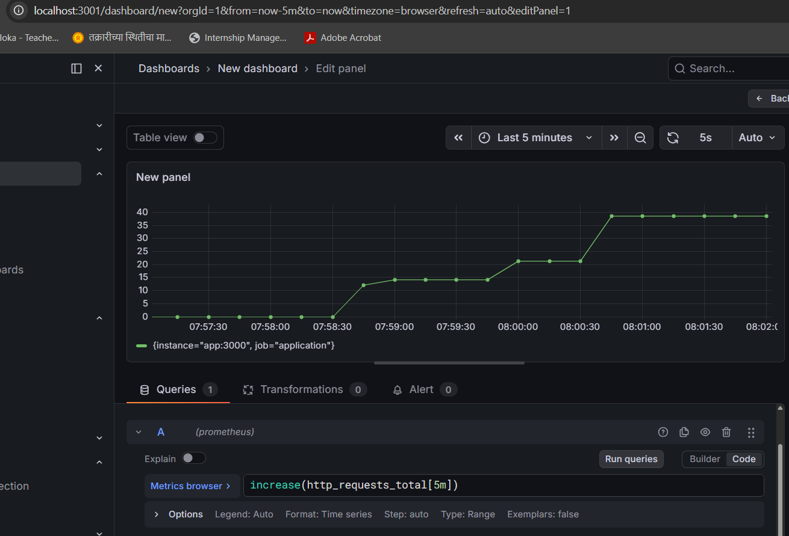

---

## 🎯 Conclusion

Traffic simulation helps in understanding system performance, identifying bottlenecks, and ensuring application reliability under varying loads.

---


