# Task: 1:  Docker Basics with Flask App

##  Overview

This task demonstrates basic Docker operations by containerizing and running a Flask application from the given repository.

---

## Prerequisites

* Docker installed

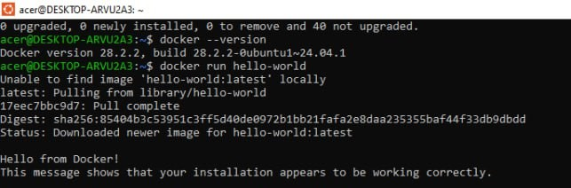


Configured Docker to run as a non-root user.

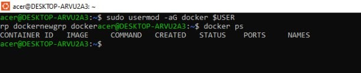
---

## Setup & Run

```bash
git clone https://github.com/hamzaavvan/library-management-system.git
cd library-management-system

docker build -t flask-library-app .
docker run -d -p 5000:5000 --name flask-container flask-library-app
```

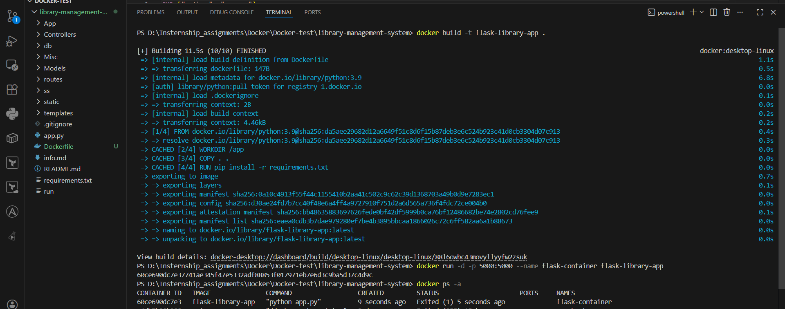


---

##  Container Management

```bash
docker stop flask-container
docker start flask-container
docker restart flask-container
docker rm -f flask-container
```

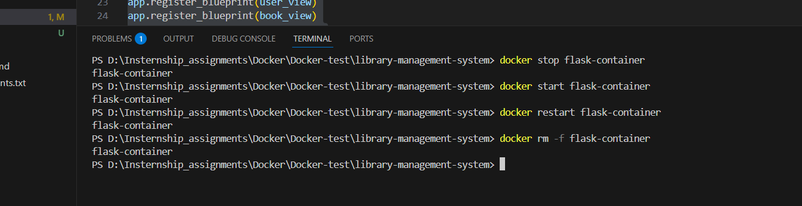
---

## 🔍 Inspection Commands

```bash
docker ps
docker logs flask-container
docker exec -it flask-container /bin/bash
docker inspect flask-container
```

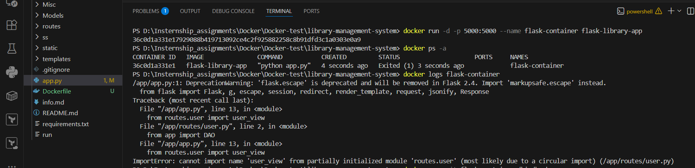

---

## Volume Mounting

### Bind Mount

```bash
docker run -d -p 5000:5000 -v $(pwd):/app flask-library-app
```


### Named Volume

```bash
docker volume create flask-data
docker run -d -p 5000:5000 -v flask-data:/app/data flask-library-app
```


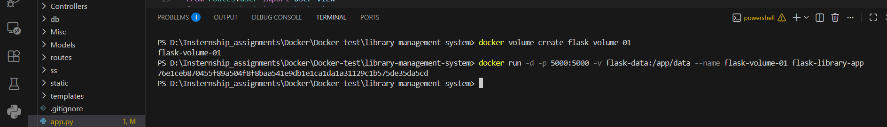


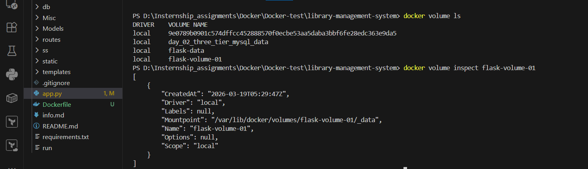
---

##  Summary

* Installed and configured Docker
* Built and ran Flask container
* Managed container lifecycle
* Inspected container details
* Used bind mount and named volumes for persistence


# Task:2: Custom Docker Image (Multi-Stage)

## Overview
This task demonstrates building an optimized Docker image using multi-stage builds and best practices.

## Features
- Multi-stage Docker build
- Slim base image
- Non-root user for security
- Layer caching optimization
- .dockerignore for smaller image

## Build & Run
docker build -t <username>/library-app:v1 .
docker run -d -p 5000:5000 <username>/library-app:v1


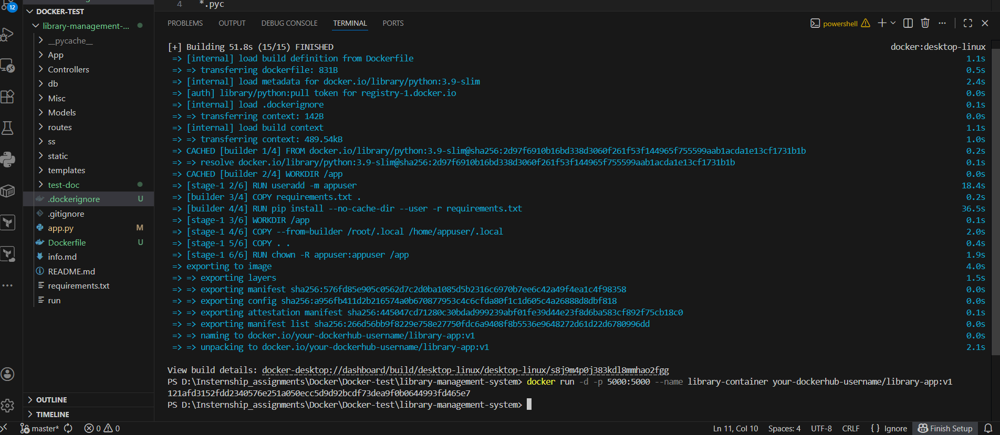


## Versioning
- v1: Initial version
- v2: Updated version

## Push to Docker Hub
docker push <username>/library-app:v1
docker push <username>/library-app:v2

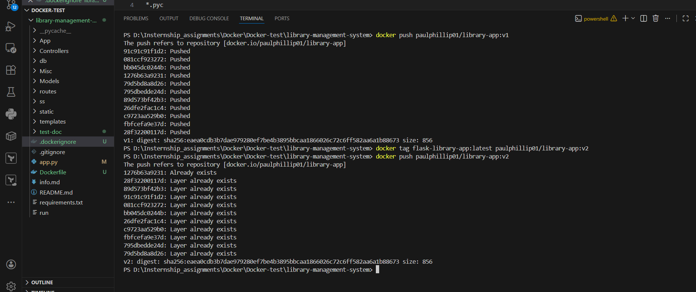


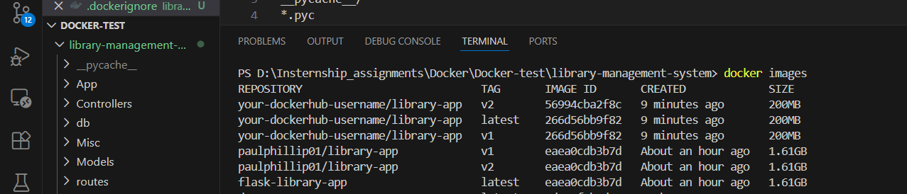


## Docker Networking with Flask & MySQL

This task demonstrates Docker networking concepts by running a Flask application with a MySQL database and testing connectivity using different network modes.


## Setup

git clone https://github.com/hamzaavvan/library-management-system.git
cd library-management-system

## Custom Bridge Network
- Create Network: docker network create my-network
- Run MySQL Container: docker run -d \ --name mysql-db \ --network my-network \ -e MYSQL_ROOT_PASSWORD=root \ -e MYSQL_DATABASE=library_db \ mysql:8.0
- Run Flask App Container: docker build -t flask-app .
docker run -d \ --name flask-app \ --network my-network \ -p 5000:5000 \ flask-app

✔ Flask app connects to MySQL using hostname: mysql-db


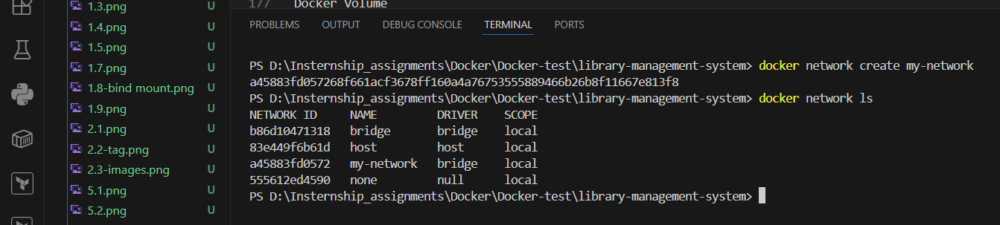


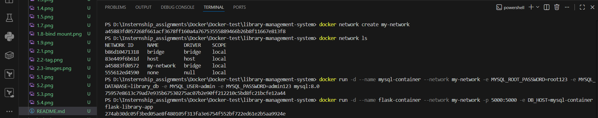


# Docker Compose - 3 Tier App

## Services
- Flask App
- MySQL Database
- Nginx Reverse Proxy

## Run
docker compose up -d --build

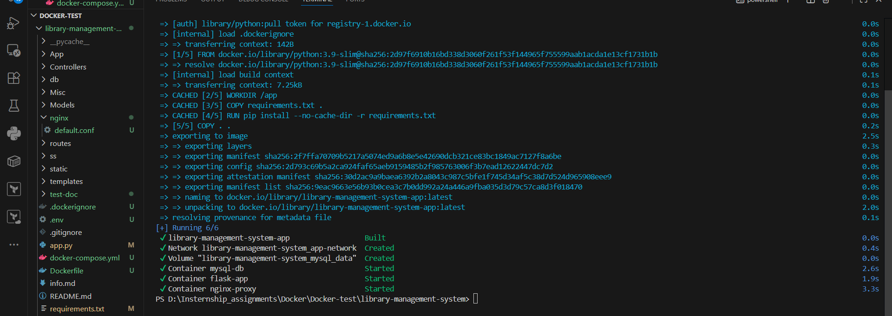


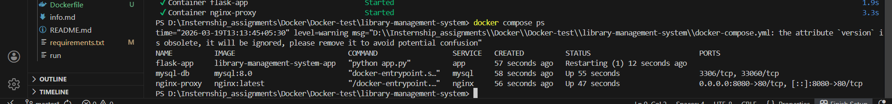


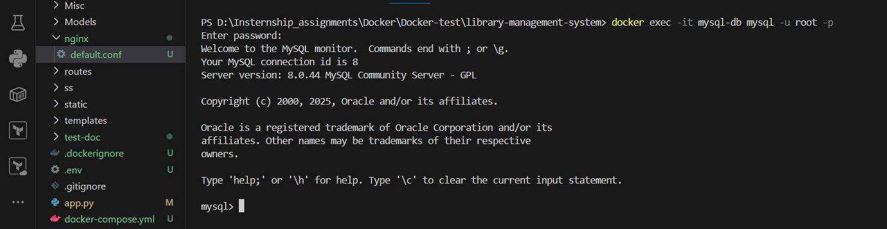


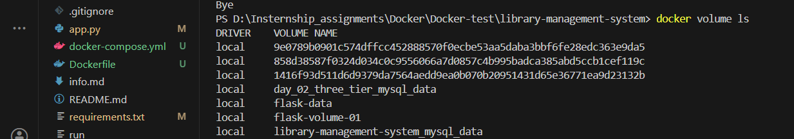


## Access
http://localhost:8080


## Documentation 

1. Difference: Image vs Container vs Volume vs Network

Docker Image
A read-only template created using dockerfile and used to create containers. It includes application code, libraries, and dependencies.
- Example: python:3.9-slim

Docker Container
A light-weight, isolated environment where an application runs along with all its requires libraries and configuration.
- Example: Running Flask app container

Docker Volume
Used for persistent data storage outside the container. Data remains even if the container is removed.
- Example: Storing MySQL database files

Docker Network
Enables communication between containers. Containers can connect using service names.
- Example: Flask app connecting to MySQL using mysql


2. Cleaning Up Unused Docker Resources

- Remove stopped containers: docker container prune
- Remove unused images: docker image prune
- Remove unused volumes: docker volume prune
- Remove unused networks: docker network prune
- Remove everything unused : docker system prune -a


3. Best Practices for Secure Dockerfiles

- Use minimal base images
Prefer lightweight images like alpine or slim to reduce attack surface.


- Use multi-stage builds
Separate build and runtime stages to reduce final image size.

- Pin image versions
Avoid latest; use specific versions for consistency.

- Use .dockerignore
Exclude unnecessary files like .git, logs, and local environments.

- Reduce layers & optimize caching
Combine commands and order instructions efficiently.

- Avoid hardcoding secrets
Use environment variables or .env files instead.

